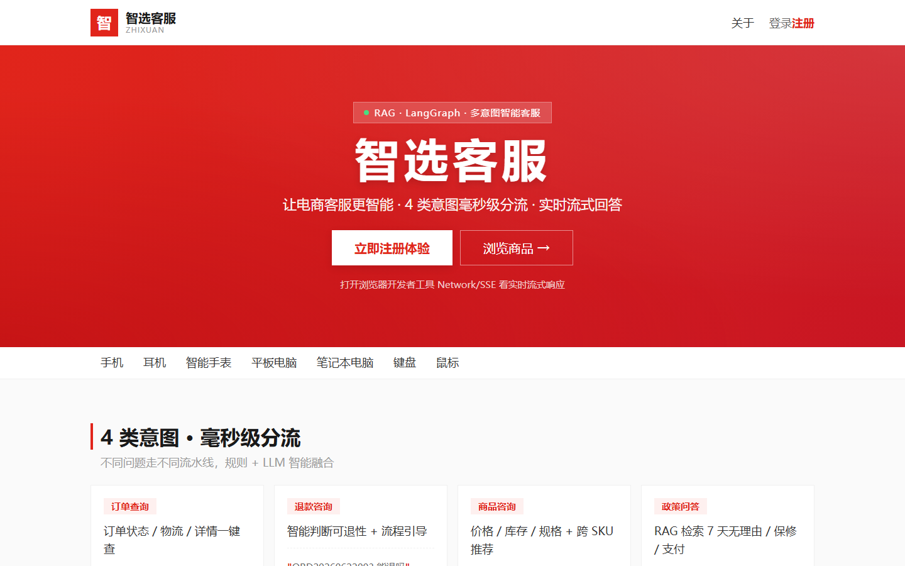
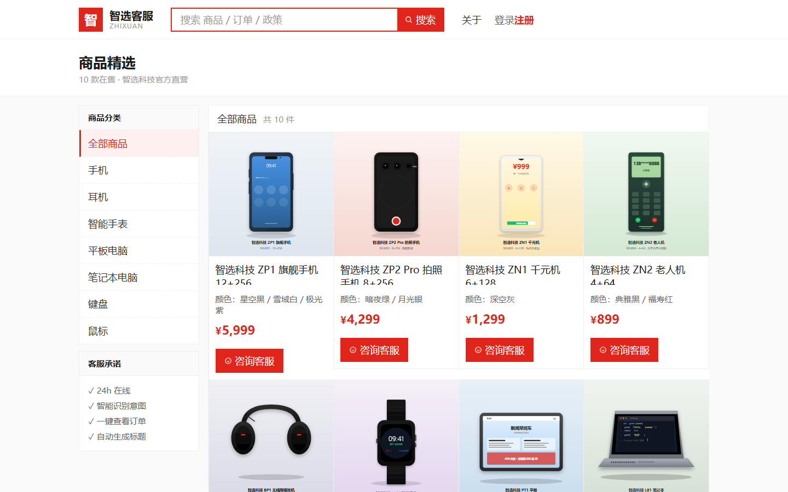
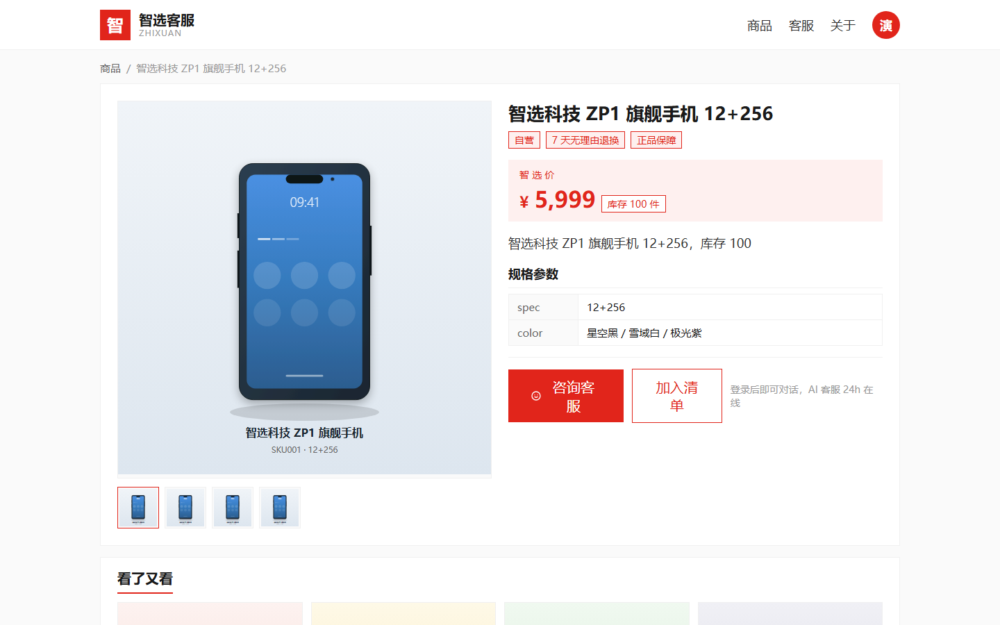
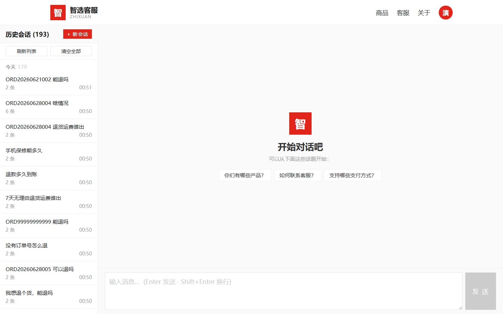
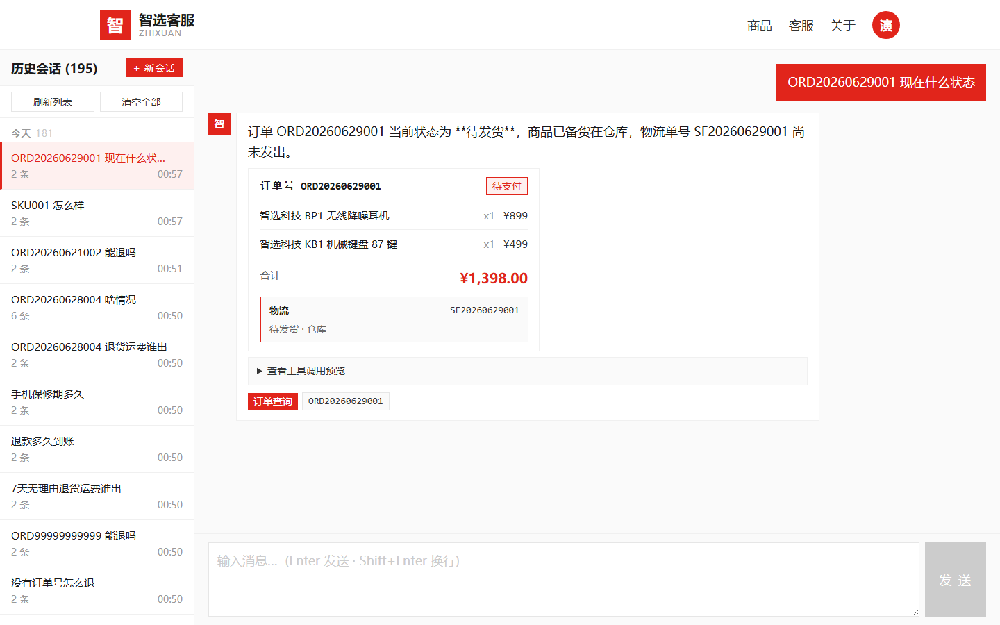
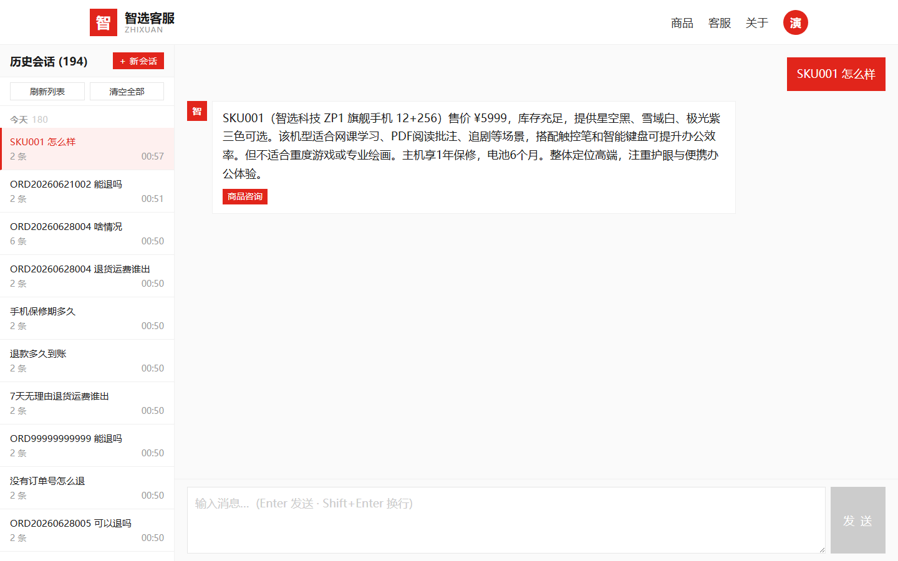

# 智能客服 Agent 系统

> RAG 检索增强 · 流式问答 · 多轮会话 · 全栈 Docker 化部署

[](https://fastapi.tiangolo.com)
[](https://vuejs.org)
[](https://python.org)
[](https://typescriptlang.org)
[](https://qdrant.tech)
[](https://docker.com)
[](LICENSE)
<!-- Status badge: 填入真实 healthcheck.io UUID 后会显示实时 ECS 健康状态 -->
<!-- 注册地址：https://healthcheck.io → 新建 check → Period=5min → 复制 UUID 替换下方 YOUR-UUID-HERE -->
<!-- 文档：docs/HEALTHCHECK.md -->


---

## 🌐 在线演示（公网 ECS，已部署）

> 任何人可直接访问，无需注册即可体验客服 AI

| 入口 | 地址 | 用途 |
|------|------|------|
| **前端 Web UI** | http://120.79.27.124:5173 | 主入口，点「体验」一键登录 |
| **Swagger API 文档** | http://120.79.27.124:8000/docs | 在线调 API、看 Pydantic schema |
| **健康检查** | http://120.79.27.124:8000/health | mysql/redis/qdrant 三件套状态 |
| **测试账号** | `demotest` / `demotest123` | 含 4 个真实订单可演示退款 LangGraph |

Qdrant 控制台 (`6333/dashboard`) 内网-only（按需开安全组）。

---

## 📖 项目简介

**智能客服 Agent** 是一个基于 RAG（Retrieval-Augmented Generation）架构的端到端对话系统。
用户提问时，系统先从向量知识库中检索相关资料，再交由大语言模型生成回答，
实现"基于事实、可追溯"的智能问答。

适用于：电商售后、技术支持、企业内部知识库、产品 FAQ 等场景。

**项目特点**：

- 🔍 **完整 RAG 链路** —— query → embedding → Qdrant 检索 → context 组装 → LLM 生成
- ⚡ **SSE 流式输出** —— 大模型逐字返回，前端实时呈现打字效果
- 💬 **多轮对话** —— 基于会话 ID 的上下文管理，支持跨轮指代
- 🔐 **完整鉴权** —— JWT（httpOnly Cookie）+ bcrypt 密码加密 + 角色管理
- 🛡 **可观测性** —— `/health` 三组件探测、`operation_log` 全量审计
- 🐳 **一键部署** —— 5 服务 Docker Compose，开发与生产双套配置
- 📦 **数据闭环** —— admin 端知识入库、来源追溯、chunk 可视化

---

## 📸 效果展示

### 首页 & 商城

| 首页（4 类意图分流） | 商品列表 | 商品详情 |
|---|---|---|
|  |  |  |

### 智能客服聊天

| 多轮对话（左历史会话列表 + 右主区） | 上下文：订单 | 上下文：商品 |
|---|---|---|
|  |  |  |

### 完整流程演示（公网 ECS 实测）

8 张顺序截图覆盖登录 → 浏览 → RAG 咨询 → 退款 LangGraph → 个人中心：

[`frontend/_screenshots/walkthrough/demo-01-home.png`](frontend/_screenshots/walkthrough/demo-01-home.png) → [`demo-08-profile.png`](frontend/_screenshots/walkthrough/demo-08-profile.png)

### 订单生命周期流转

`pending` → `paid` → `shipped` → `delivered` → `refunded`（6 张状态截图）：
[`loop-01-product-detail.png`](frontend/_screenshots/loop-01-product-detail.png) → [`loop-06-profile-refunded.png`](frontend/_screenshots/loop-06-profile-refunded.png)

> 截图由 `scripts/verify_demo_public.py` + Playwright 在公网 ECS 自动生成（120.79.27.124）。

---

## ✨ 核心特性

| 模块 | 能力 |
|------|------|
| **检索增强（RAG）** | DashScope `text-embedding-v3`（1024 维）→ Qdrant HNSW 索引 → top-k=5 余弦相似度 |
| **流式问答** | SSE（Server-Sent Events）单向推送；前端 `EventSource` 接收 + Markdown 实时渲染 |
| **多轮会话** | MySQL 持久化 + Redis 热路径缓存；cursor 分页拉历史 |
| **知识库管理** | admin 端 `/admin/ingest` 入库（chunk_size + overlap 可配）；`/admin/knowledge/sources` 追溯 |
| **用户系统** | 注册 / 登录 / 改密 / 角色；`/auth/me` 返回用户统计 |
| **会话管理** | 列表 / 详情 / 软删除；按用户隔离 |
| **审计日志** | `operation_log` 表记录 IP / UA / 动作 / 详情 |
| **健康检查** | `/health` 同时探测 mysql / redis / qdrant 状态 |
| **生产部署** | dev / prod 双 compose override；环境变量集中管理；日志与数据卷分离 |

---

## 🛠 技术栈

| 层 | 选型 | 用途 |
|----|------|------|
| 后端框架 | FastAPI 0.115 | REST + SSE，依赖注入，Pydantic 校验 |
| 前端框架 | Vue3 + Vite + TypeScript | 组件化，类型安全 |
| LLM | 通义千问 qwen-max（DashScope OpenAI 兼容）| 流式对话生成 |
| Embedding | DashScope text-embedding-v3 | 1024 维文本向量化 |
| 向量库 | Qdrant v1.10 | 单二进制，REST + gRPC 双协议 |
| 关系库 | MySQL 8.0（utf8mb4）| 用户 / 会话 / 消息 / 知识元数据 / 审计 |
| 缓存 | Redis 7 | 会话热路径，LRU 淘汰 |
| 反向代理 | nginx (alpine) | 前端静态服务 + API 反代 + SSE 流式 |
| 部署 | Docker Desktop + WSL2 | 5 服务一键编排 |

---

## 🏗 系统架构

```
                  ┌─────────────────────────────────────────┐
                  │      Frontend (Vue3 + Vite + TS)        │
                  │   ChatPage / MarkdownView / SSE 接收   │
                  └─────────────────┬───────────────────────┘
                                    │ httpOnly Cookie + SSE
                                    ▼
        ┌───────────────────────────────────────────────────────────┐
        │                 Backend (FastAPI :8000)                   │
        │                                                           │
        │   api/  ─→  services/  ─→  rag/pipeline.py                │
        │   (路由)    (编排)         │                              │
        │              │             │                              │
        │              ▼             ▼                              │
        │       session_service   ┌─────────┐     ┌────────────┐    │
        │       (Redis+MySQL)     │ Qdrant  │     │  Qwen LLM  │    │
        │              │          │ 检索    │     │  流式生成   │    │
        │              ▼          └─────────┘     └────────────┘    │
        │        ┌─────────┐           ▲                            │
        │        │  MySQL  │           │                            │
        │        │ (冷路径) │           │                            │
        │        └─────────┘           │                            │
        └──────────────────────────────┴────────────────────────────┘
                                       │
                              ┌────────┴────────┐
                              │     Redis       │
                              │   (热路径)      │
                              └─────────────────┘
```

**分层原则（严格遵守）**：

| 层 | 职责 | 禁止 |
|----|------|------|
| `api/` | 路由、参数解析、调 services | 写业务逻辑 |
| `services/` | 业务编排（调 core/rag/clients）| 直接连 DB |
| `core/` | LLM / embedding 等核心能力 | 调外部 HTTP API 路由 |
| `rag/` | 检索 + 生成 pipeline | 写入 chat handler |
| `clients/` | Qdrant / Redis / MySQL 连接 | 写业务逻辑 |
| `models/` | ORM 模型 | 写逻辑 |
| `schemas/` | Pydantic 模型 | 写逻辑 |
| `utils/` | 纯函数工具 | 引用其他层 |

---

## 🚀 快速开始

### 前置要求

- Docker Desktop（WSL2 后端）
- 通义千问 API Key（[申请地址](https://dashscope.console.aliyun.com/apiKey)）

### 启动步骤

```bash
# 1. 进入部署目录
cd deploy

# 2. 复制环境变量模板
cp .env.example .env.dev

# 3. 编辑 .env.dev，填入：
#    QWEN_API_KEY=sk-xxxxx
#    JWT_SECRET=<openssl rand -hex 32 生成>

# 4. 启动 5 个服务
docker compose --env-file .env.dev up -d --build

# 5. 验证
curl http://localhost:8000/health
# → {"status":"ok","components":{"mysql":"up","redis":"up","qdrant":"up"}}
```

### 访问入口（公网 ECS：http://120.79.27.124）

| 地址 | 说明 | 可用 |
|------|------|------|
| http://120.79.27.124:5173 | 前端 Web UI（主入口） | ✅ |
| http://120.79.27.124:8000/docs | Swagger API 文档（FastAPI 自动生成） | ✅ |
| http://120.79.27.124:8000/health | 健康检查（mysql/redis/qdrant 三件套） | ✅ |
| http://120.79.27.124:6333/dashboard | Qdrant 控制台 | ❌ 安全组未开放（按需开启） |
| http://120.79.27.124:8000 | API 根路径（返回服务自描述 JSON） | ✅ |

### 初始化账号

首次启动**不会**自动创建任何账号，需要手动操作：

```bash
# 1. 注册一个普通用户
curl -X POST http://localhost:8000/api/auth/register \
  -H "Content-Type: application/json" \
  -d '{"username":"myuser","password":"mypassword123"}'

# 2. 提升为 admin（直接改 MySQL）
docker exec customer-service-mysql mysql -ucs_user -pcs_pass_2026 customer_service \
  -e "UPDATE users SET role='admin' WHERE username='myuser';"
```

测试账号（已 seed，仅用于演示）：
- `demotest` / `demotest123`：4 个真实订单可演示 LangGraph 退款状态机的 4 路径
- `admin`：通过上述方式手动创建并提权后即可登录 `/api/admin/*` 后台

---

## ⚙️ 配置说明

所有配置集中在 `deploy/.env.example`，关键变量：

| 变量 | 说明 | 必填 |
|------|------|------|
| `QWEN_API_KEY` | 通义千问 API Key | ✅ |
| `JWT_SECRET` | JWT 签名密钥（≥ 32 字符）| ✅ |
| `MYSQL_ROOT_PASSWORD` | MySQL root 密码 | ✅ |
| `MYSQL_PASSWORD` | MySQL 应用账号密码 | ✅ |
| `APP_ENV` | `dev` / `prod` | — |
| `LOG_LEVEL` | `DEBUG` / `INFO` / `WARNING` | — |

---

## 📡 API 端点

| 方法 | 路径 | 说明 | 鉴权 |
|------|------|------|------|
| GET | `/health` | 健康检查（mysql/redis/qdrant）| ❌ |
| POST | `/auth/register` | 注册 | ❌ |
| POST | `/auth/login` | 登录（form → Set-Cookie JWT）| ❌ |
| GET | `/auth/me` | 当前用户 + 统计 | ✅ |
| POST | `/chat` | RAG 多轮问答（SSE 流式）| 可选 |
| GET | `/conversations` | 当前用户会话列表 | ✅ |
| GET | `/conversations/{sid}/messages` | 会话消息（cursor 分页）| ✅ |
| DELETE | `/conversations/{sid}` | 软删会话 | ✅ |
| POST | `/admin/ingest` | 知识入库 | admin |
| GET | `/admin/knowledge/sources` | 知识来源列表 | admin |

---

## 📚 文档

| 文档 | 内容 |
|------|------|
| [`docs/learning_log.md`](docs/learning_log.md) | 项目演进日志（1472 行，14 个模块，每个含 What / Why / Tech / Flow / Problem→Fix / Role）|
| [`docs/OPERATIONS.md`](docs/OPERATIONS.md) | 运维指南（端口、数据卷、故障排查、生产部署）|
| [`docs/HEALTHCHECK.md`](docs/HEALTHCHECK.md) | healthcheck.io 接入指南（5 min 接入 + 告警演练）|
| [`docs/test_coverage.md`](docs/test_coverage.md) | 测试覆盖矩阵（115 单元 + ~100 E2E，10 个测试文件）|

---

## 🔧 设计决策（关键技术选择的理由）

### 1. 为什么用 SSE 而不是 WebSocket？

LLM 输出是**单向服务器推送**，SSE 直接复用 HTTP（鉴权、反代都简单）；
WebSocket 双向协议反而过度设计。

### 2. 为什么 MySQL + Redis 双写？

- **MySQL**：持久化、消息历史可追溯、支持 cursor 分页
- **Redis**：会话热路径，避免每次请求都打 DB
- **写穿透策略**：MySQL 失败仅 warning，不影响 SSE done 事件（best-effort）

### 3. 为什么选 Qdrant 而不是 Milvus / ES？

- **单二进制部署**：Docker Desktop 友好
- **REST + gRPC 双协议**：调试方便
- **HNSW 默认索引**：ANN 检索速度足够
- **payload 过滤 + 向量检索**混合能力强

### 4. Qdrant 为什么是 1024 维？

阿里 DashScope `text-embedding-v3` 默认输出 1024 维。
Qdrant collection 的 `vector_size` 必须**严格匹配**，否则报 `Wrong dimensions` 错误。
两边常量在模块顶部加注释强制同步。

### 5. 流式滚动为什么需要节流？

每收一个 token 就 `scrollTop` 会卡顿（DOM 操作阻塞主线程）。
用 `requestAnimationFrame` 把 50ms 内的多次 scroll 合批，性能提升 ~10x。

### 6. 为什么不用 LangChain？

- **过度抽象**：业务逻辑藏在 chain 里，调 bug 翻三层
- **依赖重**：本项目用 OpenAI SDK 直调，3 行代码解决
- **可读性**：直调更便于理解底层 LLM 调用机制

---

## 🗂 目录结构

```
E:\智能客服\
├── backend/                  # FastAPI 后端
│   ├── app/
│   │   ├── api/              # HTTP 路由（auth / chat / conversations / admin）
│   │   ├── services/         # 业务编排（session / auth / rag / audit）
│   │   ├── core/             # 核心能力（config / security / embedding / qwen）
│   │   ├── rag/              # 检索 pipeline + ingest
│   │   ├── clients/          # Qdrant / Redis / MySQL 连接
│   │   ├── models/           # ORM 模型（5 张表）
│   │   ├── schemas/          # Pydantic 模型
│   │   └── main.py           # FastAPI 入口
│   ├── requirements.txt      # 依赖锁版本
│   └── Dockerfile
├── frontend/                 # Vue3 前端
│   └── src/components/       # 6 个组件（ChatPage / MessageList / MarkdownView…）
├── deploy/                   # Docker Compose 编排
│   ├── docker-compose.yml    # 5 服务开发环境
│   ├── docker-compose.prod.yml
│   └── .env.example
├── docs/                     # 项目文档
│   ├── learning_log.md       # 演进日志（1472 行）
│   └── OPERATIONS.md         # 运维指南
├── LICENSE                   # MIT
└── README.md                 # ← 你正在看
```

---

## 🤝 贡献

欢迎提交 Issue 和 Pull Request。

开发前请阅读：
- `docs/learning_log.md` —— 了解项目演进历程和设计权衡
- 各模块顶部的中文 docstring —— 说明模块职责和禁止事项

---

## 📄 License

[MIT](LICENSE)