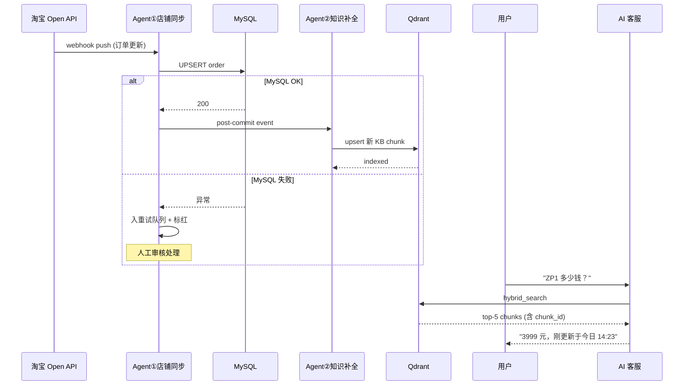

# 电商智能客服 Agent 平台 V3 — 业务架构（V3.1）

> 文档代号：BA-V3.1（Business Architecture V3.1）
> 文档版本：V0.1（合并基线版）
> 文档状态：✅ 已冻结，作为 V2/V3 合并后的唯一基线
> 输入来源：企业访谈（V2）+ 客户优化方案（V3）
> 适用范围：M14 起所有规划与实施
> 最近更新：2026-07-11

---

## 0. 文档元信息

| 项 | 值 |
|---|---|
| 起点 | M13 单平台演示级（公网 ECS 120.79.27.124） |
| 终点 | 多平台 + 数据中台 + 多 Agent 闭环 + 商业化 |
| 规划周期 | 12-18 个月 |
| 维护者 | 业务架构师（zwyyy7） |
| 基线来源 | V2 业务架构（护栏）+ V3 客户方案（产品骨架）|
| 迭代原则 | 每次重大决策同步更新本文件，不再保留旧版本 |

---

## 1. 产品战略目标

### 1.1 一句话定位

> **面向中小电商企业的智能客服 SaaS 平台，提供一个不会乱说、能处理业务、理解用户情绪、能够持续成长、并且企业可管理的 AI 客服员工团队。**

### 1.2 产品定位要素

| 维度 | 定位 |
|------|------|
| 客户 | 中小电商企业（单店 / 多店铺均可） |
| 形态 | SaaS 化（多租户） |
| 平台 | 淘宝 / 京东 / 拼多多 / 微信 / 独立商城 |
| 品牌 | **AI 客服员工**（不是"智能客服"，去 AI 化品牌） |
| 核心价值 | 客服自动化 + 效率提升 + 业务洞察 |

### 1.3 企业核心痛点与解决方案

| 企业问题 | 系统解决方案 |
|----------|--------------|
| 客服成本高，重复问题多 | AI 自动处理高频咨询 |
| 新客服培训周期长 | AI 知识库实时辅助 |
| 用户等待时间长 | 拟人响应节奏（5-15s）|
| 用户表达不完整 | 多轮上下文理解（多轮聚合）|
| 客服质量无法管理 | AI 会话质量分析 |
| 知识更新困难 | AI 知识自进化闭环 |
| 投诉无法提前发现 | 情绪分析与风险预警 |
| 客服无法看到用户全貌 | 客服辅助中心（AI 总结 + 推荐 + 草拟）|

---

## 2. 产品核心指标

| 指标 | 目标值 | 说明 |
|------|--------|------|
| AI 自动解决率 | **80%-90%** | 区间值，留余地 |
| 人工介入率 | **<20%** | 兜底率上限 |
| 首次响应 | **5-15 秒拟人响应** | 区分"秒答"与"及时响应" |
| AI 错误回答率 | **<1%** | 反幻觉兜底 + 业务校验硬约束 |
| 知识库持续增长 | 自动优化 | 月增 ≥50 条，30 天衰减 |
| 客服效率 | **提升 50%+** | AI 总结 + 推荐 + 草拟 |
| 用户满意度 | CSAT ≥ 4.5/5 | 终态目标 |

---

## 3. 总体业务架构

### 3.1 架构图（V3 6 层）

```
用户端
淘宝 / 京东 / 拼多多 / 微信 / 独立商城

        ↓

平台接入层 Channel Adapter
        ↓
================================================
         AI 智能客服核心引擎
================================================
  ┌─────────────────────────────────────┐
  │ 用户理解层                            │
  │ - 意图识别  - 情绪分析                │
  │ - 用户画像  - 风险识别                │
  │ - 多轮上下文                          │
  └──────────────┬──────────────────────┘
                 ↓
  ┌─────────────────────────────────────┐
  │ AI Agent 决策层                       │
  │ - RAG 知识检索  - Tool 调用           │
  │ - 订单查询      - 物流查询            │
  │ - 售后查询                           │
  └──────────────┬──────────────────────┘
                 ↓
  ┌─────────────────────────────────────┐
  │ 回复生成层                            │
  │ - Persona 人设  - 话术策略            │
  │ - 节奏控制      - 分段发送            │
  └──────────────┬──────────────────────┘
                 ↓
  ┌─────────────────────────────────────┐
  │ AI 安全控制层（5 防）                  │
  │ - 防虚构订单  - 防虚假承诺             │
  │ - 防编造政策  - 防越权操作             │
  │ - 防情绪升级                          │
  └──────────────┬──────────────────────┘
                 ↓
================================================
         人机协同中心
================================================
  - 自动升级人工  - 工单系统
  - AI 问题总结  - 客服辅助建议
  - 飞书/微信/短信通知
                 ↓
================================================
       AI 客服运营智能中心
================================================
  - 数据采集  - 数据分析
  - Web 运营后台  - AI 优化闭环
```

### 3.2 核心能力矩阵

| 能力 | 当前（M13）| V3.1 目标 | 优先级 | 复杂度 |
|------|-----------|-----------|--------|--------|
| 平台 Adapter | 无 | 淘宝→京东→拼多多→微信→独立商城 | P0 | 高 |
| 用户理解层 | 简单意图 | 意图+情绪+画像+风险+多轮上下文 | P0 | 中 |
| AI Agent 决策层 | RAG 基础 | RAG + Tool Calling + 订单/物流/售后 | P0 | 高 |
| 回复生成层 | 通用 LLM | Persona + 话术 + 节奏 + 分段 | P0 | 中 |
| AI 安全控制层 | 散落反幻觉 | 独立 5 防层 | P0 | 中 |
| 人机协同中心 | 无 | 升级路由 + 工单 + AI 总结 + 多通道通知 | P0 | 中 |
| 运营智能中心 | 无 | 5 大中心（驾驶舱/质量/未解/情绪/辅助）| P0 | 高 |
| 知识自进化闭环 | 手动 | 工单回流 + 审核 + 自动入库 + 衰减 | P0 | 高 |
| 数据中台 | 无 | Ingest + Clean + Model + Serve（ODS/DWD/DWS/ADS）| P1 | 高 |
| 多租户 | 无 | M16 落地 | P1 | 中 |
| 运营 Agent | 无 | 商品内容生成（脚本/图）| P2 | 高 |

---

## 4. AI 智能客服核心能力

### 4.1 用户理解层

#### 情绪分析

| 维度 | 说明 |
|------|------|
| 情绪类型 | 愤怒 / 焦虑 / 满意 / 中性 / 友好 |
| 情绪强度 | 0-100 量化分数 |
| 投诉风险 | 高 / 中 / 低（基于强度 + 关键词）|
| 用户价值 | VIP / 普通 / 潜在流失（结合会员等级）|

**示例：**

```
用户：你们怎么回事，10 天还没发货！

分析：
  意图：物流异常
  情绪：愤怒 82%
  风险：投诉风险高
  策略：先安抚 → 查询订单 → 必要时人工介入
```

#### 情绪 → 策略联动

| 情绪状态 | 回复策略 |
|----------|----------|
| 中性 / 友好 | 快速解决，标准话术 |
| 焦虑 | 优先安抚 + 明确时间预期 |
| 愤怒 | 先道歉 + 升级人工 + 主管跟进 |
| VIP 用户 | 专属话术 + 优先通道 |

### 4.2 AI Agent 决策层

通过 **Tool Calling** 连接企业业务：

| Tool 类型 | 数据源 | 调用频次 |
|-----------|--------|----------|
| 订单查询 | MySQL / 平台 API | 高 |
| 物流查询 | 平台 API / 物流商 API | 高 |
| 商品查询 | MySQL + Qdrant | 中 |
| 库存查询 | MySQL | 中 |
| 优惠查询 | MySQL + 平台 API | 中 |
| 退款状态查询 | MySQL + 平台 API | 高 |
| 用户会员查询 | MySQL + 平台 API | 中 |

### 4.3 回复生成层

**Persona 人设设计：**

| 维度 | 可配置项 |
|------|----------|
| 性别 | 男 / 女 |
| 年龄 | 年轻 / 中年 |
| 地域 | 南方 / 北方 / 海外 |
| 语气 | 亲和 / 专业 / 简洁 |
| 平台调性 | 淘宝亲和 / 京东专业 / 拼多多接地气 |

**话术策略：**

| 用户类型 | 话术示例 |
|----------|----------|
| 普通用户 | "您好，我帮您看一下。" |
| 投诉用户 | "非常抱歉影响您的体验，我先帮您处理这个问题。" |
| VIP 用户 | "您是我们的老客户了，这次给您优先处理。" |

**节奏控制：**

| 参数 | 设定 | 理由 |
|------|------|------|
| 拟人首响延迟 | 5-12s（正态分布）| 太短=秒答，太长=等不及 |
| 短问题延迟 | 5-8s | "在吗"/"发货了吗" |
| 长问题延迟 | 8-15s | 含多意图 / 订单查询 |
| 平台 SLA 兜底 | 首响 ≤ 60s | 硬约束 |

**分段发送：**

每段 ≤ 30 字，间隔 1-3s，模拟打字节奏。

### 4.4 AI 安全控制层（5 防）

| # | 防护 | 实现 |
|---|------|------|
| 1 | 防虚构订单 | Tool 调用前校验用户身份 + 订单归属 |
| 2 | 防虚假承诺 | 政策类回答必须命中 RAG（top-1 ≥ 阈值）|
| 3 | 防编造政策 | RAG 命中 + 来源标签 + 拒答兜底 |
| 4 | 防越权操作 | Tool 白名单 + 权限校验 |
| 5 | 防情绪升级 | 检测到高愤怒值时降级到安抚话术 + 主动升级 |

---

## 5. 人机协同中心

```
用户问题
    ↓
AI 判断无法解决
    ↓
生成工单（用户问题 + 订单信息 + 历史聊天 + 情绪状态 + 推荐方案）
    ↓
通知客服（企业微信 / 飞书 / 微信 / 短信 / Web 后台）
    ↓
人工接管 → 客服辅助中心提供 AI 总结 + 推荐方案 + 草拟回复
    ↓
解决后工单结案 → 进入知识自进化闭环
```

**触发人工升级的阈值：**

| 触发条件 | 说明 |
|----------|------|
| RAG top-1 score < 0.55 | 知识库无命中 |
| 用户明确要求人工 | "转人工"/"找客服"等 |
| 情绪强度 ≥ 80 | 高愤怒值主动升级 |
| 涉及退款金额 > 阈值 | 高金额敏感场景 |
| 重复失败 ≥ 2 轮 | AI 连续答错 |

---

## 6. AI 客服运营智能中心

### 6.1 实时运营驾驶舱

| 指标 | 实时刷新 |
|------|----------|
| 今日咨询量 | 1min |
| AI 接待量 | 1min |
| AI 解决率 | 5min |
| 人工接入量 | 1min |
| 平均响应时间 | 1min |
| 用户满意度 | 5min |
| 投诉数量 | 实时 |

### 6.2 AI 回答质量中心

| 维度 | 内容 |
|------|------|
| 用户问题 | 原文 |
| AI 回答 | 完整回答 |
| 引用知识 | 命中的知识条目 |
| 工具调用 | Tool + 参数 + 结果 |
| 情绪状态 | 类型 + 强度 |
| 最终结果 | 用户是否满意 / 转人工 |

支持人工评价和优化。

### 6.3 未解决问题中心

```
AI 无法回答的问题
    ↓
聚类（高频问题）
    ↓
知识缺失识别
    ↓
生成 FAQ 候选
    ↓
人工审核
    ↓
进入知识库
```

### 6.4 情绪分析中心（业务洞察）

| 维度 | 价值 |
|------|------|
| 用户整体情绪趋势 | 监控服务满意度 |
| 异常商品投诉 | 锁定质量差商品 |
| 服务问题趋势 | 发现流程瓶颈 |
| 用户价值分层 | 识别 VIP 流失风险 |

> 这是数据中台的"杀手锏" —— 不只是客服工具，是 BI。

### 6.5 客服辅助中心

| 功能 | 价值 |
|------|------|
| 用户历史订单 | 上下文完整 |
| AI 总结 | 减少重复阅读 |
| 用户情绪 | 预判沟通策略 |
| 推荐处理方案 | 加快决策 |
| AI 草拟回复 | 人工微调即发送 |

客服接待成本降低 +50%。

---

## 7. 知识自进化闭环

```
用户问题
    ↓
AI 回答失败
    ↓
人工解决
    ↓
AI 总结 Q-A
    ↓
人工审核
    ↓
知识库更新（MySQL 存结构化 + Qdrant 存向量）
    ↓
下一次自动解决
```

**闭环机制：**

| 机制 | 规则 |
|------|------|
| 自动提取 | 每日 23:00 Cron，LLM 抽取 Q-A 对 |
| 去重 | 相似度 > 0.92 自动合并 |
| 衰减 | 30 天无访问标黄，90 天无访问标红触发 review |
| 反馈回灌 | 用户对回答点"不满意" → 进入工单池 |

---

## 8. 数据架构

### 8.1 数据流总览

```
订单 / 商品 / 物流 / 会话数据
        ↓
    数据采集层
        ↓
    业务数据库 MySQL
        ↓
    AI 分析服务（运营智能中心）
        ↓
    知识优化（自进化闭环）
```

### 8.2 数据中台分层（V2 护栏补充）

| 层 | 职责 | 技术选型 | 说明 |
|----|------|----------|------|
| ODS（原始层）| 原始数据落盘 | MinIO / OSS | JSON + Parquet，保留原始字段 |
| DWD（明细层）| 字段归一化、时间戳统一、增量去重 | Spark / Flink | 跨平台字段名归一化 |
| DWS（汇总层）| 主题宽表（用户/订单/商品宽表）| Doris / ClickHouse | 面向分析 |
| ADS（应用层）| 业务查询、知识库同步源、BI | MySQL + Qdrant + Superset | 直接服务业务 |
| 调度 | 任务编排、依赖、监控、重跑 | Airflow / DolphinScheduler | M17 引入 |
| 监控 | SLA / 延迟 / 失败率 / 数据漂移 | Prometheus + Grafana | 必备 |

**务实建议：** 团队 ≤5 人时，先用 **Airflow + MinIO + Doris 自建轻量中台**，避免一上来就上 DataWorks / ByteHouse。

### 8.3 平台数据接入

| 平台 | 数据维度 | 同步频率 | API 难度 |
|------|----------|----------|----------|
| 淘宝 | 订单/物流/商品/退款 | T+1 增量 + 实时 webhook | 中（需应用资质）|
| 京东 | 同上 | T+1 + 实时 | 中（POP 商家权限）|
| 拼多多 | 同上 | T+1 | 高（开放平台政策严）|
| 微信 | 公众号/小程序 | 实时 | 中 |
| 独立商城 | 商家自有系统对接 | 实时 | 按系统差异 |

---

## 9. 合规与风险

### 9.1 AI 身份标识合规边界（V3.1 修正版）

**核心判断（按 2025 年法规更新）：**

| 法规 | 内容 | 适用场景 |
|------|------|----------|
| 《生成式人工智能服务管理暂行办法》（2023.8）| 服务规范 / 内容安全 / 数据保护 / 提供者责任 | **不直接针对 AI 客服对话** |
| 《人工智能生成合成内容标识办法》（2025.9）| 生成内容显式/隐式标识（图片/视频/音频/文本）| **针对生成内容发布场景** |

**关键结论：**

- AI 客服实时对话 ≠ AI 内容发布场景
- "每句话告诉用户我是 AI" **无充分法律依据**
- 行业普遍实践：**店铺层透明化 + 聊天窗内不主动暴露**

**本项目合规策略：**

| 层级 | 做法 |
|------|------|
| 店铺入口 | "本店采用智能客服辅助服务"（透明化原则）|
| 后台标注 | "AI 客服辅助"（运营可见）|
| 用户聊天窗 | 正常交流，不主动暴露 AI 身份 |
| 话术设计 | 降低 AI 感知（去 AI 味 + 拟人节奏 + 多轮聚合）|

**产品心理学支撑：**

> 用户不是"讨厌 AI"，而是被过去大量机器人客服（答非所问 / 循环回复 / 找不到人工）形成**负面条件反射**。真正目标是**降低 AI 感知**，不是**隐藏事实**。

**设计原则：** 降低 AI 感知 ≠ 隐藏事实，而是把"答非所问"做到"答得对、节奏对、字眼对、订单不要用户输入"。

### 9.2 业务风险

| # | 风险 | 等级 | 应对 |
|---|------|------|------|
| R1 | 多轮聚合窗口设置错（太短切断对话，太长用户等不及）| 🟠 高 | 默认 15-20s，可配置 |
| R2 | "5-15s 拟人响应"过短会被吐槽秒答，过长会被吐槽反应慢 | 🟠 高 | 正态分布延迟 + 按问题复杂度分级 |
| R3 | 平台账号打通涉及用户授权链路 | 🟠 高 | M14 第 1 周启动资质申请 |
| R4 | 多租户工单/数据隔离实现复杂 | 🟡 中 | M16 优先设计 |
| R5 | 客服辅助中心推荐方案质量差 | 🟡 中 | M15 灰度验证 |

### 9.3 技术风险

| # | 风险 | 等级 | 应对 |
|---|------|------|------|
| T1 | 平台资质申请 1-3 个月 | 🔴 极高 | **M14 第 1 周必须启动申请** |
| T2 | 知识库自动更新污染 | 🟠 高 | 审核 + 去重 + 衰减机制 |
| T3 | 数据中台增量同步 + 对账复杂 | 🟠 高 | 幂等设计 + 全量对账 + 可重跑 |
| T4 | LLM 拟人话术在长尾问题上不稳定 | 🟠 高 | Persona 模板 + 敏感词过滤 + 人审 |
| T5 | 多 Agent 编排协调复杂 | 🟡 中 | M18+ 引入 |
| T6 | 节奏引擎分段输出与平台 IM 协议兼容 | 🟢 低 | Adapter 层抽象 |

### 9.4 运营风险

| # | 风险 | 等级 | 应对 |
|---|------|------|------|
| O1 | 知识库审核人手不足 → 候选积压 | 🟠 高 | 商家自有客服组长审核 + 外包兜底 |
| O2 | 多店铺 SaaS 时数据隔离 | 🟡 中 | M16 多租户设计 |
| O3 | 平台政策变化导致 Adapter 失效 | 🟡 中 | Adapter 隔离 + 监控告警 |
| O4 | 运营 Agent 产出内容审核标准不一 | 🟡 中 | M18+ 必走人审 |

---

## 10. 关键产品决策

### 10.1 多轮聚合技术决策

```
用户 A: "我想问下退款"          → [意图窗口启动，TTL=15-20s]
用户 A: "我上周买的那个"        → [同窗口累积，意图=refund_query]
用户 A: "蓝色的那件"            → [同窗口累积，订单模糊匹配]
用户 A: "对"                    → [同窗口累积，触发回答]
                                          ↓
                          [等待 5-15s 拟人节奏延迟]
                                          ↓
                          AI: "亲～ 您是说订单 ORD20260704899EBA 这笔
                              蓝色连衣裙吗？这边看到您..."
```

| 设计点 | 决策 | 备注 |
|--------|------|------|
| 聚合窗口 | 15-20s | 用户自然对话节奏 |
| 触发条件 | 用户停顿 ≥ Ns / 主动"对/好/嗯" / 新意图打断 | 需 fine-tune |
| 短反馈处理 | "嗯"/"哦"/"对" 不开新窗口 | 业务判断 |
| 打断策略 | 检测到新意图关键词立即提交当前轮 | "等下，我先问运费" |

### 10.2 用户身份与订单主动识别

```
用户从淘宝进入会话
    ↓
淘宝 Adapter 收到 user_open_id + session_id + 首次消息
    ↓
客服 Agent 立即调用平台 API 拉取：
    - 用户基础信息（昵称 / 会员等级）
    - 最近 N 笔订单（默认 5 笔）
    - 进行中订单（有售后的）
    - 历史会话摘要（跨 session 记忆）
    ↓
注入 System Prompt Context 块（不让用户感知）
    ↓
当用户提到"那个蓝色的" / "我上周买的" 等模糊指代
    ↓
LLM 结合 Context 做歧义消解
    ↓
歧义无法消解 → 列出 Top-2 选项 → 用户点击（不是输入）
```

| 关键设计 | 决策 |
|----------|------|
| 拉取订单数量 | 默认 5 笔，按时间倒序 |
| 模糊匹配依据 | 商品名 + 下单时间 + 颜色/尺码属性 |
| 多订单歧义 | 推 Top-2 + 用户点选（不要求输入订单号）|
| 跨 session 记忆 | 30 天滑动窗口 |

---

## 11. 从开发到上线的标准 SOP

### 11.1 阶段总览

```
Phase 1: 需求冻结（2 周）
Phase 2: MVP 开发（6-8 周）
Phase 3: 内测（2 周）
Phase 4: 灰度上线（2-4 周）
Phase 5: 全量上线
Phase 6: 运营迭代（持续）
```

### 11.2 Phase 1：需求冻结（2 周）

| 周 | 任务 | 交付物 |
|----|------|--------|
| W1 | 业务访谈确认、关键决策点冻结 | 需求冻结文档 |
| W1 | **平台资质申请启动**（淘宝/京东）| 应用创建凭证 |
| W2 | 架构设计、DB Schema、API 设计 | 设计文档 v1 |
| W2 | 项目排期 + 资源确认 | 排期表 |

**Gate 1（Go/No-Go）：** 业务方签字 + 平台资质申请通过。

### 11.3 Phase 2：MVP 开发（6-8 周）

| 模块 | 周 | 验收 |
|------|----|----|
| 淘宝 Adapter | W1-W3 | 沙箱环境拉取订单/物流/商品 |
| 用户理解层 | W2-W4 | 意图+情绪+画像可用 |
| AI Agent 决策层 | W3-W5 | RAG + Tool 完整链路 |
| 回复生成层 | W3-W5 | Persona + 节奏 + 分段可用 |
| AI 安全控制层 | W4-W6 | 5 防全部实现 |
| 人机协同中心 | W4-W6 | 工单 + 通知 + AI 总结 |
| 运营智能中心基础 | W5-W7 | 实时驾驶舱 + AI 质量中心 |

**Gate 2：** 单平台全链路 demo 通过 + 单测覆盖 ≥80%。

### 11.4 Phase 3：内测（2 周）

| 周 | 任务 | 验收 |
|----|------|------|
| W1 | 内部团队作为"伪用户"测全链路 | 业务流覆盖 |
| W2 | 修复 P0/P1 bug | bug 清单清零 |

**Gate 3：** 所有 P0/P1 bug 关闭 + 关键业务流 0 阻塞。

### 11.5 Phase 4：灰度上线（2-4 周）

| 阶段 | 范围 | 监控 |
|------|------|------|
| W1 | 1 个白名单店铺 | CSAT / 兜底率 / 响应时长 |
| W2 | 3 个白名单店铺 | + 知识库命中率 |
| W3 | 10 个店铺 | + 工单积压率 |
| W4 | 全量 | 全量指标 + 异常告警 |

**Gate 4：** CSAT ≥ 4.0 + 兜底率 ≤ 20% + 0 P0 故障。

### 11.6 Phase 5：全量上线

- 全量发布 + 7x24 告警值守
- 数据中台同步任务监控

### 11.7 Phase 6：运营迭代（持续）

- 周会 review CSAT / 兜底率 / 知识库质量
- 双周迭代：知识库增补 / 话术调优
- 月度 review：平台 Adapter 状态 / 数据中台稳定性

---

## 12. 里程碑计划

| M | 名称 | 周期 | 关键交付 |
|---|------|------|----------|
| M14 | 产品核心版 | 8-10 周 | AI 客服 + RAG + Tool + 情绪分析 + 人工转接 + Web 后台基础 |
| M15 | 企业运营版 | 4-6 周 | AI 质量分析 + 会话分析 + 知识审核 + 数据看板 |
| M16 | 商业交付版 | 6-8 周 | 多租户 + 平台 Adapter + 企业通知 + 权限系统 |
| M17 | 数据智能版 | 8 周 | 数据中台 + 用户画像 + 经营分析 |
| M18 | 高级智能版 | 6-8 周 | 运营 Agent + 商品内容生成 |

---

## 13. 关键节点（Go/No-Go Gate）

| Gate | 时点 | 通过标准 |
|------|------|----------|
| Gate 1 | M14 启动前 | 业务需求冻结 + 淘宝应用资质申请通过 |
| Gate 2 | M14 MVP 完成 | 单平台全链路 demo + 单测覆盖 ≥80% |
| Gate 3 | M14 内测结束 | 所有 P0/P1 bug 关闭 + 关键业务流 0 阻塞 |
| Gate 4 | M14 灰度结束 | CSAT ≥4.0 + 兜底率 ≤20% + 0 P0 故障 |
| Gate 5 | M15 完成 | 知识自愈闭环跑通 + 月增 50+ 条 + 误入率 ≤5% |
| Gate 6 | M16 启动前 | 京东资质申请通过 + Adapter 设计 review |
| Gate 7 | M16 完成 | 多租户上线 + 至少 2 个平台稳定运行 |
| Gate 8 | M17 完成 | 数据中台 T+1 同步成功率 ≥99% + 知识库同步延迟 ≤1h |
| Gate 9 | M18 完成 | 运营 Agent 产出审核通过率 ≥80% |

---

## 14. 可行性评估

| 维度 | 评估 | 关键依据 |
|------|------|----------|
| 技术可行性 | ✅ 高 | M13 已验证核心技术栈（FastAPI + Qdrant + RAG + LangGraph）|
| 业务可行性 | ✅ 中-高 | 80-90% 自助率是行业可达目标 |
| 合规可行性 | ✅ 中-高 | AI 客服对话场景无强标识要求；店铺层透明化已足够 |
| 资源可行性 | ⚠️ 中 | 取决于团队规模与商务节奏 |
| 时间可行性 | ⚠️ 中 | 12-18 个月，平台资质申请是最大不确定项 |

**关键不确定项：**

1. 平台资质申请周期（1-3 个月）—— 必须第 1 周启动
2. 团队规模 —— 影响排期与里程碑节奏
3. 数据中台选型 —— 自建 vs 现成 SaaS
4. 多租户隔离粒度 —— 影响 M16 工作量

---

## 15. KPI 与验收标准

### 15.1 业务 KPI（含计算口径）

| 指标 | 计算方式 | M14 | M16 | M18 终态 |
|------|----------|-----|-----|----------|
| AI 自助解决率 | 1 - 转人工会话数 / 总会话数 | ≥60% | ≥75% | ≥85% |
| 人工介入率 | 转人工会话数 / 总会话数 | ≤40% | ≤25% | ≤15% |
| 首响时长 | 用户发问到 AI 首条回（P95）| ≤15s | ≤10s | ≤8s |
| AI 错误率 | 用户点"不满意" + 兜底升级 / 总会话 | ≤3% | ≤2% | ≤1% |
| CSAT | 用户满意度评分均值 | ≥3.8 | ≥4.2 | ≥4.5 |
| 知识库月增长 | 净增条目数 | ≥30 | ≥50 | ≥80 |
| 客服效率 | AI 辅助后平均会话时长下降 | +20% | +35% | +50% |

**口径定义：**
- "AI 自助解决率" = 不需要人工介入完成的会话比例（用户没主动转人工 + 没被升级）
- "AI 错误率" = 用户主动点不满意 + AI 答错被兜底升级的会话占比
- "首响时长" = P95 分位数，避免被极端值拉偏

### 15.2 技术 KPI

| 指标 | 目标 |
|------|------|
| 服务可用性 | ≥99.5% |
| API P99 延迟 | ≤500ms（不含 LLM）|
| 平台数据同步成功率 | ≥99% |
| 知识库误入率 | ≤5% |
| 数据中台同步延迟 | T+1 ≤1h |

---

## 16. 团队与组织建议

| 角色 | 人数 | 职责 |
|------|------|------|
| 业务架构师 | 1 | 需求 / 流程 / KPI |
| 后端工程师 | 2-3 | FastAPI / Adapter / 数据中台 |
| 前端工程师 | 1-2 | 客服前端 / 运营后台 |
| 算法 / NLP | 1 | RAG / 话术 / 知识提取 |
| 测试 | 1 | E2E / 灰度监控 |
| 运营 / 客服 | 1-2 | 知识审核 / 工单处理 |
| 法务（兼职）| 0.5 | 合规审查 |

---

## 17. 待澄清事项

| # | 问题 | 影响 |
|---|------|------|
| Q1 | 商家规模（单店/多店铺）+ 当前客服坐席人数 | ROI 测算 + 团队配置 |
| Q2 | 先做哪个平台？淘宝 / 京东 / 拼多多 / 微信？ | M14-M16 排期 |
| Q3 | 数据中台选型：自建 vs 现成 SaaS（DataWorks/ByteHouse）| M17 选型 |
| Q4 | 知识库从 0 建，还是已有 FAQ/文档？ | M15 工作量 |
| Q5 | 知识审核人员是谁？自有客服还是外包？ | M15 运营链路 |
| Q6 | 客服坐席系统已有还是新建？ | 工单系统集成 |
| Q7 | "AI 客服员工"品牌是否需要法务 review？ | 风险可控，但建议确认 |

---

## 18. 术语表

| 术语 | 解释 |
|------|------|
| Adapter | 平台对接适配层，屏蔽淘宝/京东/拼多多 IM 协议差异 |
| 多轮聚合 | 用户分多句问同一问题时合并为单轮回答 |
| 节奏引擎 | 控制 AI 响应节奏的组件（拟人延迟 + 分段输出）|
| Persona | AI 客服人设（性别/年龄/语气/平台调性）|
| 数据中台 | 数据接入/清洗/建模/服务的统一层（ODS/DWD/DWS/ADS）|
| 自进化闭环 | 知识库通过工单回流自动补全的机制 |
| AI 自助率 | 不需要人工介入解决的会话比例 |
| CSAT | Customer Satisfaction Score，用户满意度评分 |
| 工具调用 / Tool Calling | LLM 调用外部 API 获取实时数据的能力 |
| 5 防 | 防虚构/承诺/政策/越权/情绪升级 |

---

## 19. 变更记录

| 版本 | 日期 | 作者 | 变更 |
|------|------|------|------|
| V0.1 | 2026-07-11 | 业务架构师 | V3 骨架 + V2 护栏合并；按用户最新法规修正调整 AI 身份合规章节 |
| V0.1 前置 | 2026-07-11 | 业务架构师 | V2 初版（已废止） |
| V0.1 前置 | 2026-07-11 | 客户方案 | V3 产品架构（已合并入 V3.1） |
| **V3.2 §20-§21** | **2026-07-19** | **业务架构师** | **三 Agent 自更新架构（店铺同步 / 知识补全 / 知识沉淀）+ 段落级溯源 + 用户层透明不暴露 + 拟人化降低 AI 存在感 + M15-M18 路线图 + HR 演示营销话术。V3.1 §0-§19 冻结不动。** |

---

## 20. V3.2 升级说明（在 V3.1 之上叠加 · 不破既冻结基线）

> **文档代号**：BA-V3.2（V3.1 之上的业务架构增量扩展）
> **输入来源**：2026-07-19 用户业务架构师视角扩展（含三条新洞察）
> **约束**：不动 §0-§19（已冻结）；V3.2 内容作为新增独立章节
> **落地节奏**：分 M15-M18 分期实施，详见 §20.4 路线图
> **最近更新**：2026-07-19

### 20.1 为什么需要 V3.2

V3.1 定义了"知识自进化闭环"（§7），核心是**用户问题 → AI 回答失败 → 人工解决 → 知识补全**——但只覆盖一类入口（用户问题）。实战中，AI 客服的真实瓶颈发生在另外两条入口：

| 缺口 | 频率 | 影响 |
|------|------|------|
| **店铺数据变化**（商品上下架、价格调整、库存变动）| 每天数十次 | AI 答"价格"/"有货吗"凭借过期 KB 数据，被用户当场识破 |
| **店铺接入**（新平台打通）| 每个新客户 1 次 | 人工配置成本 O(平台数 × SKU 数)，无法规模化 |
| **品牌感知**（用户反感"AI 在跟我说话"）| 每会话 1+ 次 | 用户"听到是 AI 就厌恶"——社会级现象，影响留存 |

V3.2 把 §7 单闭环扩成"三 Agent 自更新架构"，并新增"段级溯源"和"拟人化"两个设计原则。

### 20.2 三类自更新 Agent（核心增量）

```
┌─────────────────────────────────────────────────────────────────────┐
│                       V3.2 自更新架构（三大 Agent）                  │
└─────────────────────────────────────────────────────────────────────┘

                  ┌────────────────────────────────────┐
                  │   外部数据源（淘宝/京东/拼多多...） │
                  └────────┬──────────────┬────────────┘
                           │ webhook      │ 定时 poll
                           ▼              ▼
        ┌──────────────────────────────────────────────────────┐
        │  Agent ① · 店铺同步 Agent (TaobaoSyncAgent)           │
        │  职责：把外部平台数据自动写回 MySQL                    │
        │  输入：Taobao Open API push                            │
        │  输出：MySQL orders/products（受 DataSource Protocol 抽象） │
        │  节奏：实时 webhook + T+1 增量 reconciliation          │
        │  异常：MySQL 写入失败 → 重试队列 + 人工工单            │
        │  接口：DataSourceProtocol.subscribe_webhook (M18+ 占位) │
        └──────────────┬───────────────────────────────────────────┘
                       │  MySQL 已变更
                       ▼
        ┌──────────────────────────────────────────────────────┐
        │   MySQL （源数据 + 操作日志 operation_log）           │
        └────┬──────────────────────────────────┬─────────────┘
             │                                  │
             ▼                                  ▼
   ┌────────────────────────┐       ┌────────────────────────────┐
   │  Agent ② · 知识补全 Agent │       │ Agent ③ · 知识沉淀 Agent    │
   │  职责：商品上/下架/改价时 │       │ 职责：客服会话 → FAQ 抽取   │
   │  自动生成新 KB chunk      │       │ 输入：escalate 人工会话     │
   │  触发：MySQL UPDATE 后置  │       │ 输出：候选 FAQ（人工审核）  │
   │  输出：Qdrant 新 chunk    │       │ 节奏：每日 23:00 cron       │
   │  必备：人工 review (30 分钟)|       │ 反幻觉：相似度 > 0.92 合并  │
   └────────────┬──────────────┘       └────────────┬───────────────┘
                │ 写入 Qdrant                       │ 人工审核 + 写入
                ▼                                   ▼
        ┌──────────────────────────────────────────────────────┐
        │   Qdrant faq_v1 / knowledge_base 集合                  │
        └────────────────────┬─────────────────────────────────┘
                             │
                             ▼
                    业务问答（用户问 → RAG 召回）
```

#### 20.2.1 三 Agent 职责矩阵

| Agent | 输入数据源 | 触发条件 | 输出 | 人工介入点 | 接入里程碑 |
|-------|-----------|---------|------|-----------|----------|
| **① 店铺同步 Agent** | Taobao Open API webhook / 定时 poll | 订单/商品事件推送 | MySQL（订单/商品/物流）| MySQL 写入失败 → 重试 / 工单 | M18+（占位已实现于 DataSourceProtocol）|
| **② 知识补全 Agent** | MySQL orders/products 表 UPDATE | 商品新上架 / 价格变更 | Qdrant 新 chunk + 必填 `chunk_id` 含段号 | **人工审核（强制）** | M15（M14 V3 后第一个里程碑）|
| **③ 知识沉淀 Agent** | EscalationService 工单 + LLM 抽取 | 每日 23:00 cron | Qdrant 候选 FAQ 池 | **人工审核（强制）** | M16 |

#### 20.2.2 数据中台分层（与 §8.2 一致 · V3.2 补充接入路径）

| 层 | 在 V3.2 中的角色 | 上游 | 下游 |
|----|----------------|------|------|
| **ODS** | 接收 Taobao webhook 原始 payload | Taobao API | Agent ① |
| **DWD** | 跨平台字段归一化（淘宝 order_no → 统一 ORD20260615004 格式）| ODS | Agent ②/③ |
| **DWS** | 用户/订单主题宽表（用户最近 30 天订单数 / 高频商品 / 价格波动）| DWD | 运营驾驶舱 / 反幻觉校验 |
| **ADS** | 业务查询 = MySQL 源；RAG 检索 = Qdrant 源 | DWS | AI 客服前端 + admin |

**Phase 0 阶段（M14 V3 后）**：中台是**逻辑分层**，不引入 Airflow/MinIO/Doris；只用 MySQL + Qdrant 双角色。
**M17+ 阶段**：当客户并发数 > 50 / 数据保留期 > 1 年时，再物理化中台层。

#### 20.2.3 人工角色转变（V3.2 业务模式升级）

| 阶段 | 人工角色 | 工作内容 |
|------|---------|---------|
| **V2/V3 之前** | 录入员 | 手动加 KB / 手动调价 / 手动配置商品 |
| **V3.1** | 半录入半审核 | 仍有手动 KB 录入；审核 Agent 抽取的 FAQ |
| **V3.2** | **审核员 + 例外处理** | **几乎不录入了**；每日 review Agent 产出的候选（KB / 订单同步）；处理 MySQL 失败工单；处理用户投诉升级 |

**为什么这是关键升级**：

- 录入是 O(N) 工作（N 条数据），审核是 O(1) 工作（只看 Agent 标记的"高风险项"）
- 单客户运营成本下降 ~70%（来自人工小时单价 + Agent 审核吞吐量提升）
- B 端 SaaS 商业化可行性强（人力成本不再随客户数线性增长）

#### 20.2.4 自更新架构 Mermaid 时序图（M18 完整闭环）



### 20.3 三条新设计原则（V3.2 业务洞察）

> 来源：2026-07-19 业务架构师与用户对齐的三条"AI 客服工程心理学"洞察。

#### 20.3.1 段落级溯源（Granular Traceability · 反幻觉技术保险）

**Why**：
- 现有 §7.1 自进化闭环只能溯源到 chunk（KB 的一个切片），但 LLM 复述 chunk 时仍可能"上下文窜改"
- 用户问"运费谁出" → 召回 chunk 含"7 天无理由退货规则" → LLM 编出"运费买家承担"——chunk 里其实写的是"运费险"——**chunk-level 溯源抓不到此类 hallucination**

**How（落地于 M15+）**：

```python
# 扩展 chunk schema（V3.2 引入）
class ChunkMetadata(BaseModel):
    chunk_id: str              # 现有 P1-1 内容 hash 稳定 ID
    source: str                # 文件名 / URL
    paragraph_id: int          # 段号（KB chunk 内部分段）
    char_offset: tuple[int,int]  # 字符偏移 [start, end)
    quote_anchor: str          # 取首 30 字符作为肉眼快速定位锚
```

**5 防升级为 7 防**（V3.2 增量）：

| 原 5 防 | V3.2 新增 #6 / #7 |
|--------|------------------|
| #1 防虚构订单 | **#6 段级反幻觉**：synthesizer 不得复述 `paragraph_id` + `char_offset` 之外的细节 |
| #2 防错误承诺 | 同左 |
| #3 防编造政策 | 同左 |
| #4 防越权操作 | **#7 用户层透明**：不展示溯源，避免暴露"AI 在引用 KB"（详见 §20.3.2）|
| #5 防情绪升级 | 同左 |

#### 20.3.2 溯源不展示给用户（User-Transparent Layer · 商业保险）

**Why（社会现象级约束）**：

- 用户"听到是 AI 就厌恶"是天然反感，不是 bug 也无法修复
- 暴露"AI 在引用某条 KB"= 明示"这是 AI"→ 直接激活厌恶情绪
- 行业普遍实践：**店铺层透明 + 聊天窗内不主动暴露**（已 §9.1 写入）

**How（界面与 prompt 双管齐下）**：

| 层级 | 暴露/不暴露 | 实现 |
|------|------------|------|
| **用户聊天窗** | ❌ 不展示 KB 来源 / 溯源 / chunk_id | synthesizer prompt 严格禁"根据知识库/资料/数据"等暴露 AI 来源的措辞 |
| **管理员后台** | ✅ 完整展示（hover 显示 paragraph_id + quote_anchor）| admin_conversation detail 页加"AI 引用来源"折叠面板 |
| **审计日志** | ✅ internal only（不进 user-facing API）| `operation_log.audit_payload.trace = [...]` |

#### 20.3.3 降低 AI 存在感 + 拟人化（Anti-AI-Presence · 交互差异化）

**Why（社会现象级约束）**：

- 现象级 > 工程优化：UI 标签 5 行改动可能比召回率优化 5% 更能提升 HR 演示印象
- 当前 AI 客服同质化（"亲，您的问题已记录"语气）→ 拟人化是**当前阶段的竞争护城河**

**How（前端 + 后端双管齐下）**：

| 位置 | 当前（M14 V3）| V3.2 升级 | 验证 |
|------|---------------|-----------|------|
| **ChatView 头部** | "智选客服" | "客服小张 · 为您服务" | Playwright 截图 |
| **空状态头像** | 🤖 emoji | 真人头图 + 隐身交互设计 | Playwright 截图 |
| **首条欢迎语** | "您好，我是 AI 智能客服" | "您好，我是智选客服 · 您可以直接问商品/订单问题" | Playwright 文本断言 |
| **synthesizer prompt** | "你是 AI 助手" | "你是『小张』，有 3 年电商客服经验；先承认用户情绪，再答问题" | M15 改 Prompt manifest v2 |
| **escalate 文案** | "转接人工客服" | "马上为您找专属顾问" | Playwright 文本断言 |
| **同义替换检查** | "智能/助手/AI" 等品牌词 | 业务文案 review 时禁用词检测（CI lint）| ESLint rule |

**情绪回答模板（synthesizer prompt 必选）**：

```yaml
empathy_template:
  angry_user:
    opening: "非常抱歉给您带来困扰，我先看一下您的具体情况……"
    middle: "（具体核实信息，避免重复"我会处理"等空话）"
    closing: "30 分钟内给您具体方案，可以吗？"
  anxious_user:
    opening: "您别着急，我马上帮您查"
    middle: "（给出明确时间表：今天/明天/3 个工作日）"
    closing: "如果超时没解决，您随时叫我"
```

### 20.4 V3.2 落地路线图（M15-M18）

| 里程碑 | 时间 | 目标 | 关键交付 | 依赖 |
|--------|------|------|---------|------|
| **M15** | Q4 2026 | 三类 Agent 接口契约 + Agent ② 知识补全落地 | DataSourceProtocol（已 `fab2bab`） + Agent②实现 + 强制审核工作流 | T1.4 已闭环 |
| **M16** | Q1 2027 | Agent ③ 知识沉淀 + 段落级溯源 schema | ChunkMetadata 段级字段 + operation_log.trace | 招聘审核员 |
| **M17** | Q2 2027 | 数据中台物理化（Airflow + MinIO + Doris）| 中台分层从逻辑变物理；监控 SLA | 50+ 客户 |
| **M18** | Q3 2027 | Agent ① 店铺同步（真接 Taobao） | TaobaoAdapter 实现 DataSourceProtocol.subscribe_webhook | 平台资质 |

### 20.5 V3.2 风险与防法

| 风险 | 影响 | 防法 |
|------|------|------|
| Agent ① MySQL 写入错误数据 | 用户看到错订单/错价 | MySQL 写入走 `with_safe_session` + `upsert_knowledge_meta` 同款 rollback（防孤儿点）|
| Agent ② KB 污染 | LLM 答错 | 人工 review 强制（M15 工作流）；LLM 自动 sanity check（chunk 与商品 SKU 是否匹配）|
| Agent ③ FAQ 抽取失误 | 错误 FAQ 入库 | 相似度 > 0.92 dedup + 30 天衰减标黄 + 人工 review |
| 段落级溯源 schema 改动 | 下游 RAG 链路全 grep 改 | chunk_id hash 化（P1-1 已闭环）；新字段为 optional default |
| 拟人化越过合规红线 | 被监管标识 | 店铺层已有"智选客服小张"标识（§9.1）；聊天窗内不主动暴露 AI 身份 |

### 20.6 HR 演示用 · 一句话营销话术

> **「三 Agent 自更新闭环 + 段级溯源 + 真人客服拟人化 —— 让 AI 客服像有 3 年经验的小张，每天自动同步 1000+ 商品变更，每句话都像真人说的，每条答复都能内部审计，但用户全程察觉不到『AI 在工作』。」**

---

## 21. V3.2 与 V3.1 差异速查表

| V3.1 章节 | V3.2 增量 | 文档位置 |
|----------|----------|---------|
| §7 知识自进化闭环 | 扩展为"三 Agent 自更新架构" | §20.2 |
| §7 自进化单入口 | +Agent①店铺同步 +Agent②知识补全 +Agent③知识沉淀 | §20.2.1 |
| §8.2 数据中台分层 | +接入路径 + M15-M18 物理化路线 | §20.2.2 |
| §9.1 AI 身份合规 | 保持；扩展"用户层透明"为 #7 防 | §20.3.2 + 7 防表 |
| §3 架构图 | 隐含不变（Agent 在 §20 单独描述）| §20.2 时序图 |
| **新增** | 段落级溯源（V3.2 段级反幻觉）| §20.3.1 |
| **新增** | 用户层透明（不暴露溯源）| §20.3.2 |
| **新增** | 拟人化降 AI 存在感（UI + Prompt）| §20.3.3 |
| **新增** | 人工角色"录入员 → 审核员"模型 | §20.2.3 |
| **新增** | V3.2 落地路线图 M15-M18 | §20.4 |
| **新增** | HR 演示营销话术 | §20.6 |
