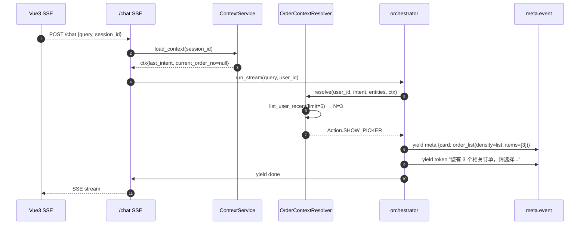
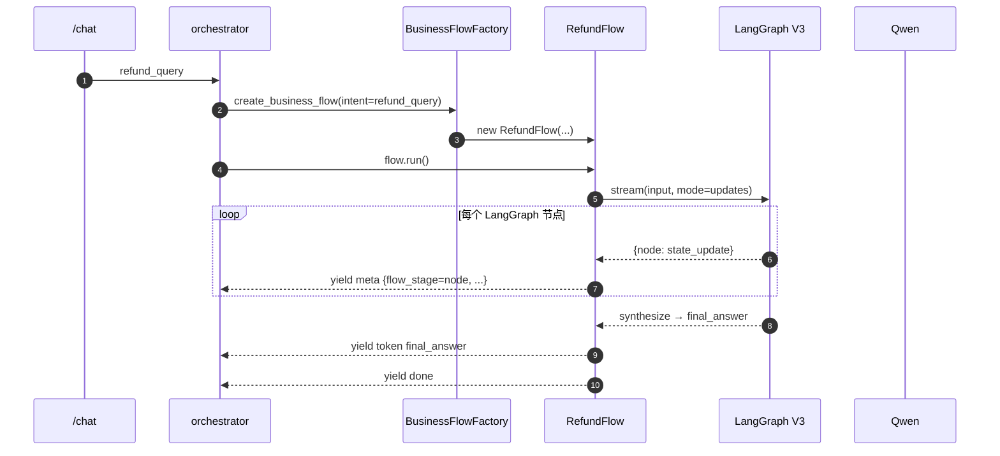

# M14 智能客服升级 — 模块架构文档

> **目标**：让 Agent 具备"知道用户是谁"的能力——用户身份上下文 → 用户画像 → 最近订单 → 意图理解 → 业务策略判断 → Agent 决策 → Tool 调用 → UI 交互 → 继续任务
>
> **核心思想**：补齐 Context（数据层）+ Resolver（决策层）+ BusinessFlow（编排层）+ SSE Card（协议层）4 层基础设施；不动现有 5 大模块的对外行为。
>
> **约束**：CLAUDE.md §9（模块化 + 接口驱动 + 强隔离）+ 不拆微服务 + 灰度开关可秒级回滚 + 单模块为主。
>
> **实施时间**：2026-07-16 / 2026-07-17，4 个阶段（1 → 4 → 2 → 3）+ 阶段 5 收尾，约 3 commit。

---

## 1. 模块概览

M14 是 V3.1 业务架构的一次大版本升级。新增 4 层基础设施：

| 层 | 模块 | 职责 |
|----|------|------|
| **数据层** | `app/services/context/` | ConversationContext KV · ContextService 加载/落盘 |
| **决策层** | `app/services/context/order_context_resolver.py` | 0/1/N 决策（DIRECT_ANSWER / SHOW_PICKER / NOT_FOUND / ASK_LOGIN_OR_LIST）|
| **编排层** | `app/services/business_flow/` | 显式状态机（当前仅 RefundFlow；包装 refund_graph V3 LangGraph）|
| **协议层** | SSE meta 字段扩展 | `meta.card`（订单卡片推送）+ `meta.flow_stage`（退款阶段指示器）|

**复用原则**：M14 不重写 session / profile / intent / order / refund 5 大模块；只在其间加协调层。

---

## 2. 目录结构

```
backend/app/services/
├── context/                                      # M14 Stage 1 新增
│   ├── __init__.py
│   ├── protocols.py                              # ContextProvider / OrderResolver Protocol
│   ├── context_service.py                        # ConversationContext load/update + DB 写入
│   └── order_context_resolver.py                 # OrderResolverAction enum + 决策矩阵
│
├── business_flow/                                # M14 Stage 3 新增
│   ├── __init__.py                                # create_business_flow 工厂入口
│   ├── protocols.py                               # Flow Protocol（结构类型）
│   ├── factory.py                                 # BusinessFlowFactory（灰度门）
│   └── refund_flow.py                             # RefundFlow（包装 V3 LangGraph + flow_stage）
│
├── chat/                                         # 复用（Sprint 3 拆分）
│   ├── orchestrator.py                            # ⭐ M14 多处改造（接入 Resolver / Flow / audit）
│   ├── prompt_assembler.py
│   ├── stream_dispatcher.py
│   └── refund_handler.py                          # handle_refund_v2 / v3 双轨制（保持不变）
│
└── audit_service.py                              # ⭐ Stage 5 加 resolver_decision 事件

backend/app/core/
└── config.py                                     # ⭐ +5 灰度开关（CONTEXT_STORE / ORDER_RESOLVER / BUSINESS_FLOW / SSE_CARD_V2 / REFUND_FLOW）

backend/config/business_rules/
├── order_context.yaml                            # M14 新增（MAX_PICKER_ITEMS 等）
└── business_flow.yaml                            # M14 新增（FLOW_STAGE_LABELS）

backend/app/schemas/
└── sse_card.py                                   # M14 新增（OrderCard Pydantic Schema）

frontend/src/
├── api/types.ts                                  # ⭐ M14 加 card/flow_stage 类型扩展
├── components/MessageCard.vue                    # ⭐ 加 card 分支（list/mini）
├── components/OrderCard.vue                      # ⭐ density=list 支持 + item_count=0 容错
├── composables/useSseContext.ts                  # M14 新增（sessionStorage SSE Context）
└── views/ChatPage.vue                            # ⭐ assistantMsg 透传 card
```

---

## 3. 4 层职责与接口

### 3.1 Context 数据层

| 组件 | 职责 |
|------|------|
| `ConversationContext` | 会话 KV：last_intent / current_order_no / flow_state |
| `ContextService` | 加载（session_id, user_id）→ `ConversationContext`；落盘（best-effort）|
| `ENABLE_CONTEXT_STORE` | 灰度开关，默认 `False`（读时返空对象）|

**为什么不直接用 Redis？** Redis 已是 checkpoint 用（M14 P2 SSE Resume），不能与 conversation context 混；落 MySQL 1:1 → Conversation 表，事务 + 灰度可控。

**关键决策（CLAUDE.md §9.4.4 L1）**：新增 `conversation_context` 表而非 `ALTER users/conversations`。

### 3.2 Resolver 决策层

| 组件 | 职责 |
|------|------|
| `OrderResolverAction` enum | 4 值：DIRECT_ANSWER / SHOW_PICKER / NOT_FOUND / ASK_LOGIN_OR_LIST |
| `OrderContextResolver.resolve()` | 0/1/N 决策矩阵（见 plan §5 F1-F5 + §6 R1-R5）|
| `ENABLE_ORDER_RESOLVER` | 灰度开关，默认 `False`（关闭时返 DIRECT_ANSWER 兼容老逻辑）|

**关键决策（D3）**：Resolver 全量灰度 + 默认关闭，与 M10/M11 一致风格（可秒级回滚）。

**决策矩阵（伪代码）**：

```python
def resolve(user_id, intent, entities, ctx):
    if user_id == ANONYMOUS_USER_ID:
        return ASK_LOGIN
    if intent != "order_query":
        return DIRECT_ANSWER  # 不参与决策
    orders = list_user_recent(user_id, limit=5)
    if len(orders) == 0:
        return ASK_LOGIN_OR_LIST
    if entities.order_no and _validate_order(user_id, entities.order_no):
        return DIRECT_ANSWER(order_no=entities.order_no)
    if len(orders) == 1:
        return DIRECT_ANSWER(order_no=orders[0].order_no)
    if ctx.current_order_no and _validate_order(user_id, ctx.current_order_no):
        return DIRECT_ANSWER(order_no=ctx.current_order_no)  # 上下文延续
    return SHOW_PICKER(reason="disambiguate")  # N > 1 默认走歧义消除
```

### 3.3 BusinessFlow 编排层

| 组件 | 职责 |
|------|------|
| `Flow` Protocol | 结构类型（`@runtime_checkable`）；name + run() |
| `BusinessFlowFactory.create()` | 单入口：`create_business_flow(intent, ...)` → Optional[Flow] |
| `RefundFlow` | 包装 LangGraph V3（fetch_order → judge → fetch_policy → check_proof → escalate / synthesize）|
| `ENABLE_BUSINESS_FLOW` | 灰度开关，默认 `False` |

**关键决策（D4 + D8）**：
1. 第 2 个 Flow 出现时再抽 Base（CLAUDE.md §3.3 YAGNI）
2. RefundFlow 包装 V3 而非替换（不破坏 LangGraph 投资；保留 V2/V3 双轨制）
3. yield 顺序与 handle_refund_v3 完全一致（向后兼容 — 消费者零改动）

**flow_stage 推送机制**：

```python
for event in refund_graph_app.stream(input, stream_mode="updates"):
    for node_name, state_update in event.items():
        if node_name in ("judge", "fetch_policy", "check_proof", "synthesize"):
            yield ("meta", {..., "flow_stage": node_name, ...})
        if node_name in ("synthesize", "escalate"):
            yield ("token", state_update.final_answer)
yield ("done", {"answer": ""})  # langgraph 路径需手动 yield done
```

### 3.4 SSE 协议层

| 字段 | 来源模块 | 前端渲染 |
|------|---------|---------|
| `meta.card` | orchestrator._handle_order / Resolver | `MessageCard.vue` card 分支 → `<OrderCard>` |
| `meta.flow_stage` | `RefundFlow` | 当前未使用（预留：阶段指示器组件） |
| `meta.resolver_action` | orchestrator._handle_order | 当前未使用（运维 grep）|
| `meta.flow_stage` 标签 | `business_flow.yaml::FLOW_STAGE_LABELS` | 前端可查表转中文 |

**关键决策（D1）**：走 `meta` 字段扩展而非新增 `card` 事件类型。原因：
1. 与 SSE Resume `seq` 一致（meta 也走 seq）
2. 一个回合最多 1 张卡片，独立事件无收益
3. 前端解析器零改动（已基于 meta.entities 渲染 OrderCard）

---

## 4. 灰度开关矩阵（5 个）

| 开关 | 默认 | 作用范围 | 关闭行为 |
|------|------|---------|---------|
| `ENABLE_CONTEXT_STORE` | `False` | ContextService 读/写 | load 返空 ConversationContext；不写 DB |
| `ENABLE_ORDER_RESOLVER` | `False` | orchestrator._handle_order | Resolver 返 DIRECT_ANSWER，行为与 M14 之前一致 |
| `ENABLE_BUSINESS_FLOW` | `False` | orchestrator refund_query 分派 | 走原 V3/V2 handle_refund_v3 双轨制 |
| `SSE_CARD_V2` | `False` | orchestrator meta.card 字段注入 | meta 不含 card（前端 fallback 到 entity 渲染）|
| `REFUND_FLOW`（隐式）| `True`（无开关）| RefundFlow 当 `BUSINESS_FLOW=True` | 自动生效；不开启 BusinessFlow 不影响 |

**一键回滚**：4 个开关全 `False` → 行为与 Sprint 4 闭环完全一致；调用方代码零修改。

---

## 5. 数据流（典型场景 F1-F5）

### 5.1 F1：用户问"我的快递怎么还没到"（无 order_no + 多订单）



### 5.2 F2：退款 Query 进 RefundFlow



---

## 6. 评测（M14 Stage 4）

| 指标 | 公式 | 阈值 |
|------|------|------|
| `proactive_list_order_accuracy` | 应 list 时实际 list 数 / 应 list 总数 | ≥ 90% |
| `multi_order_disambiguation_accuracy` | N>1 时返 SHOW_PICKER / N>1 总数 | ≥ 95% |
| `no_order_no_completion_rate` | 0 订单 ASK_LOGIN_OR_LIST / 0 订单总数 | 100% |
| `card_triggered_when_expected_rate` | 应发且实发 card / 应发总数 | ≥ 95% |

实现位置：`app/services/metrics.py::inc_resolver_decision`（threading.Lock 保护的 in-memory counter）。
导出端点：`/metrics`（JSON snapshot）。

---

## 7. Audit 留痕（M14 Stage 5）

5 个 Resolver action 路径全部调 `try_log_action(action="resolver_decision", ...)`：

| Action | detail 关键字段 |
|--------|-----------------|
| DIRECT_ANSWER (tool 直答) | `direct_answer=True, used_llm=False, card_sent=False` |
| DIRECT_ANSWER (LLM) | `used_llm=True, card_sent=<bool>, card_density=<mini|null>` |
| SHOW_PICKER | `card_sent=True, card_density="list", card_type="order_list"` |
| NOT_FOUND | `card_sent=False, invalid_order_no=<no>` |
| ASK_LOGIN_OR_LIST | `total_orders=0, card_sent=False` |

**已知限制**：orchestrator 无 Request/User/IP/UA 上下文（解耦目的），故 `try_log_action(user=None)`。完整上下文审计由 `chat` 事件（api/chat.py `done` 块）提供；通过 `target_id=str(user_id)` + 时间窗口关联。

---

## 8. 前端集成点

| TypeScript 类型 | 路径 |
|-----------------|------|
| `OrderCardPayload` | `frontend/src/api/types.ts`（list / detail / reason enum）|

| Vue 组件 | 分支 |
|---------|------|
| `MessageCard.vue` | `cardKind === 'orders'` → list 分支；`cardKind === 'order'` → mini 分支 |
| `OrderCard.vue` | `density="list"` 时不显示"共 X 件商品"行（item_count=0 时容错）|
| `ChatPage.vue` | meta?.card → `assistantMsg.card`（持久化到前端 store）|
| `useSseContext.ts` | sessionStorage 存 stream_id / card（与 SSE Resume 复用同一 hook）|

---

## 9. §9.8 8 件套交付

| # | 交付物 | 文件 |
|---|--------|------|
| 1 | 模块职责 | 本文档 §3 + 各模块 docstring |
| 2 | 接口契约 | `app/services/context/protocols.py` + `app/services/business_flow/protocols.py` |
| 3 | Pydantic Schema | `app/schemas/sse_card.py`（OrderCardPayload）|
| 4 | ORM Model | `app/models/conversation_context.py`（新表） + migration |
| 5 | 依赖图 | 本文档 §3 架构图 + §5 数据流 |
| 6 | 调用流程 | 本文档 §5（F1-F5 + R1-R5，见 plan §6）|
| 7 | 测试方案 | `tests/context/`（Resolver 0/1/N 单测）+ `tests/business_flow/`（RefundFlow 8 单测）+ `tests/eval/test_m14_resolver_metrics.py`（4 指标 + 5 路径 assert）+ `tests/test_audit_resolver.py`（6 单测）|
| 8 | 已知限制 | 本文档 §7（orchestrator 无 Request）+ §4（4 个灰度开关必须按顺序开关）|

---

## 10. 关键决策点（D1-D8 总结）

| # | 决策 | 选项 | 推荐 + 理由 |
|---|------|------|------------|
| D1 | SSE 卡片承载 | meta.card / 独立 card | **meta.card** — 与 SSE Resume seq 一致；前端解析器零改动 |
| D2 | Context 存储 | Conversation 列 / 新表 / Redis | **新表** — L1 级；不破坏既有 schema |
| D3 | Resolver 触发 | 全量 / 灰度 | **灰度 ENABLE_ORDER_RESOLVER** — 秒级回滚 |
| D4 | BusinessFlow Base | 立即抽 / 第 2 个再抽 | **第 2 个再抽** — §3.3 YAGNI |
| D5 | OrderContextCard | 新建 / 复用 OrderCard | **复用 density=list** — 单一卡片入口 |
| D6 | list 数量上限 | 硬编码 / YAML | **YAML `MAX_PICKER_ITEMS=5`** |
| D7 | useSseContext | 新建 / 不新增 | **新增** — 与 stream_id 同 hook 复用 |
| D8 | 退款业务流接入 | 替换 V3 / 包装 V3 | **包装** — 不破坏 LangGraph 投资 |

---

## 11. 演进路径

| 阶段 | 内容 | 触发条件 |
|------|------|---------|
| Stage 1（✅）| Context + Resolver | 当前 |
| Stage 4（✅）| 4 类评测指标 | 当前 |
| Stage 2（✅）| SSE Card + OrderCard list 渲染 | 当前 |
| Stage 3（✅）| RefundFlow 包装 V3 + flow_stage | 当前 |
| Stage 5（✅）| audit + 文档 | 当前 |
| V14.x 候选 | LogisticsFlow / AfterSaleFlow | 出现第 2 个 Flow 时抽 Base |
| V14.x 候选 | Resolver 决策可解释性 | 4 指标持续 < 90% 时 |
| V14.x 候选 | 主动推荐 / 反问引导 | profile + context 协同深化 |

---

## 12. 一句话总结

**M14 = 4 层基础设施（Context 数据 + Resolver 决策 + BusinessFlow 编排 + SSE Card 协议）+ 5 灰度开关 + 8 件套 + 4 评测指标 + 5 audit 留痕点。**

回到 V3.1 基线 0 行为漂移：4 个 `ENABLE_*` 开关全 `False` 时，所有 M14 代码都是 dead branch。
