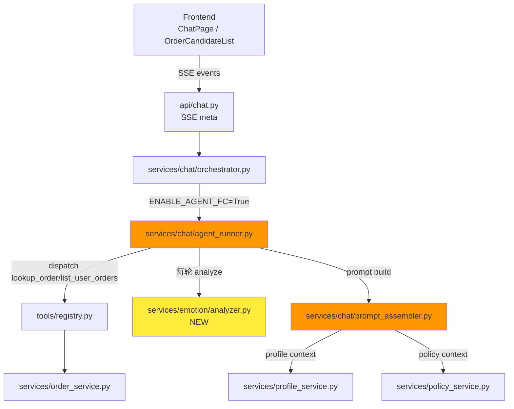
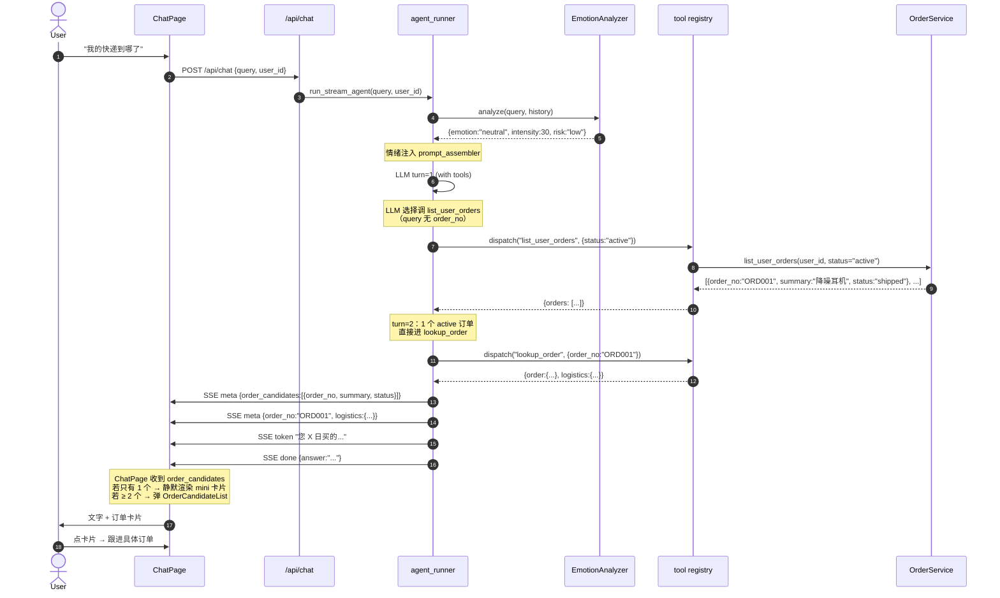
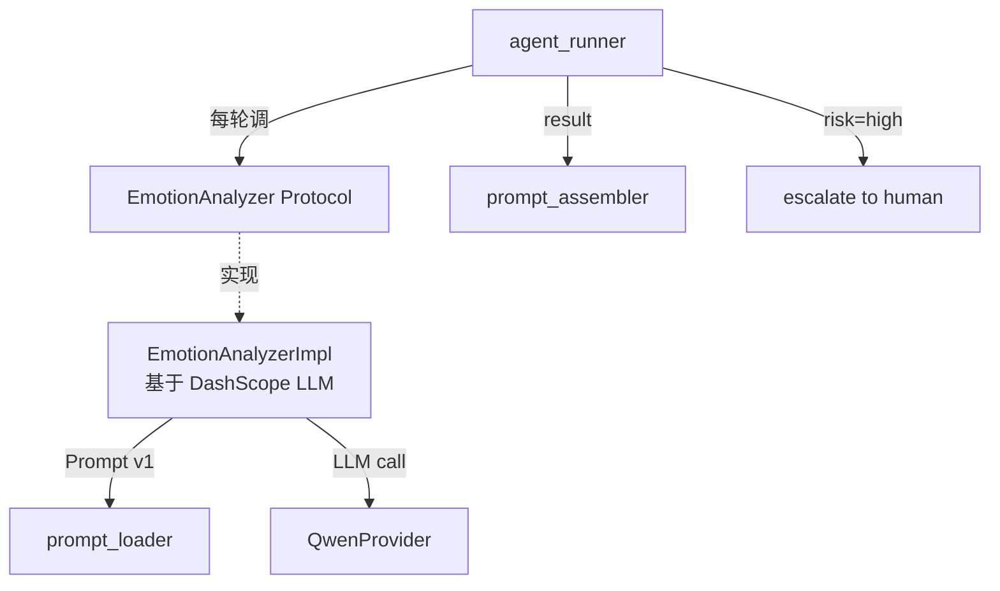
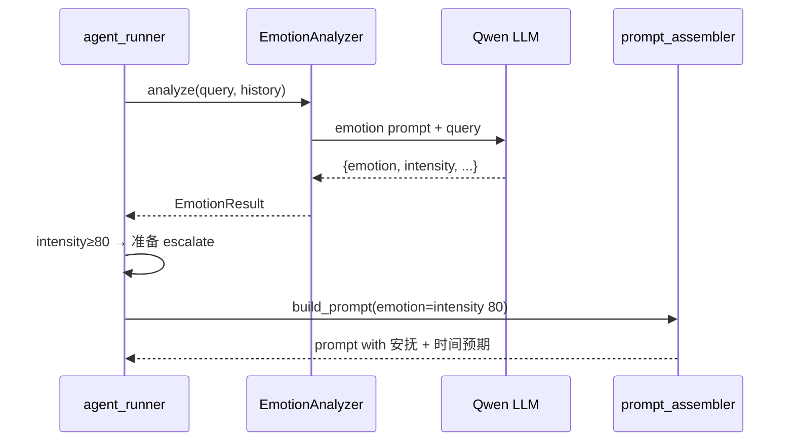

# M14 智能客服 Agent 升级设计方案

> **文档代号**：M14-AGENT-DESIGN-V1
> **范围**：架构影响 + 数据流 + Tool 设计 + Eval 标准
> **关联**：`docs/architecture/business.md`（V3.1）+ `docs/development/roadmap.md` §M14
> **前置基线**：C4 live baseline 真数据（commit `116fc90`，tool_sel=0.733）
> **状态**：📝 设计稿（待 §15 决策点确认后转实施）

---

## 0. TL;DR

**业务一句话**：让用户感觉"后面真的坐着一个客服"，而不是"知识库 + 工具调用器"。

**核心改造 3 件事**：

| # | 改造 | 价值 |
|---|---|---|
| 1 | Agent 主动拉用户最近订单（不反问订单号）| order_query 命中率 0.625 → 预期 1.000 |
| 2 | Emotion + Persona 接入（话术风格按情绪切换）| "低感知 AI" 从口号变可量化 |
| 3 | 前端订单卡片（OrderCandidateList）弹选择 | 真实淘宝客服 UX |

**范围分级**：

- **M14 P0**（必做 · 1 周）：Agent 主动查订单 + 前端 OrderCandidateList
- **M14 P1**（必做 · 2 周）：Emotion Analyzer + Prompt 联动
- **M14 P2**（可推迟 · 1 周）：Persona 拟人化 + 节奏控制

**严禁**：跨模块直接 import（CLAUDE.md §9.2.2），新增 Emotion 实现必须先有 Protocol（§9.7 #3）。

---

## 1. 业务背景

### 1.1 低感知 AI 三大原则（来自 V3.1 §1）

```
原则 1：用户感觉后面坐着一个客服，而不是 AI
  → 不是「知识库问答」；是「主动 + 选择 + 跟进」

原则 2：客服永远不需要用户重复提供已知信息
  → 订单号 / 物流单号 / 历史问题 → 主动从用户画像 + 订单池拉

原则 3：情绪感知驱动话术 + 策略
  → 愤怒 → 先道歉再解决；焦虑 → 安抚 + 时间预期；VIP → 专属话术
```

### 1.2 现状问题（基于 C4 live baseline 实跑数据）

| query | 当前 AI 行为 | 真实客服应做 | 偏差 |
|---|---|---|---|
| "我的快递到哪了" | "请提供订单号" | 主动查用户最近订单 | ❌ 反问 |
| "我要看订单状态" | "请提供订单号" | 主动查用户最近订单 | ❌ 反问 |
| "我要退这个" | 不调工具，反问 | 拉最近订单弹卡片 | ❌ 反问 |
| "你们怎么回事 10 天没发货！" | 调 search_policy | 情绪安抚 + 查订单 + 必要时人工 | ❌ 缺情绪感知 |
| "你们真好" | "不客气" | "感谢您～有问题随时找我" | ❌ 机器人腔 |

**根因 1**：Agent 只在 `order_no` 显式存在时调 `lookup_order`，否则放弃。

**根因 2**：Emotion 模块未落地（`backend/app` 搜 `emotion` 0 命中，V3.1 §4.1 写了联动表代码层没接）。

**根因 3**：Persona 配置缺失，LLM 默认话术。

---

## 2. 现状盘点（已有 vs 缺失）

### 2.1 已有能力（M13 之前已落地）

| 模块 | 状态 | 关键 API |
|---|---|---|
| OrderService | ✅ 已落地 | `list_user_orders(user_id, status, with_items)` / `get_order_detail(user_id, order_no)` |
| ProfileService | ✅ 已落地 | `get_or_create(user_id)` / `to_prompt_block(profile, max_len)` |
| Agent FC Runner | ✅ 已落地 | `run_stream_agent(query, user_id, history)`（C2 闭环） |
| Tool Registry | ✅ 已落地 | 4 个 ToolSpec：`lookup_order` / `search_product` / `search_policy` / `check_refundable` |
| OrderCard 前端 | ✅ 已落地（M10） | `<OrderCard density="list"\|"mini">` |
| Prompt 版本管理 | ✅ 已落地（Sprint 5） | `prompt_loader.load("agent_fc")` |
| SSE 流式输出 | ✅ 已落地 | `text/event-stream`，meta/token/done 事件 |

### 2.2 缺失能力（M14 需补）

| 模块 | 缺失点 | 影响 |
|---|---|---|
| Tool | `list_user_orders` 工具未注册 | Agent 无法主动查用户订单池 |
| Emotion | `EmotionAnalyzer` Protocol + 实现完全缺失 | 情绪感知 = 0 |
| Persona | `persona.yaml` + 节奏控制未实现 | 话术 = LLM 默认 |
| 前端 | `<OrderCandidateList>` 组件缺失 | 多个订单时无 UX 承载 |
| Eval | 无低感知 AI 量化评测集 | "低感知" 不可验证 |

---

## 3. M14 升级范围

### 3.1 M14 P0（必做 · 1 周）

**目标**：order_query 命中率 0.625 → 1.000；UX 与淘宝客服对齐。

| # | 改造点 | 模块 | 工时 |
|---|---|---|---|
| P0-1 | 新增 Tool：`list_user_orders(user_id, status)`（无需 order_no）| tools/registry.py | 0.5 天 |
| P0-2 | agent_runner：query 无 order_no 时自动调 list_user_orders | services/chat/agent_runner.py | 1 天 |
| P0-3 | agent_runner：返回 `order_candidates` SSE meta（供前端弹卡片）| 同上 | 0.5 天 |
| P0-4 | 新增前端组件：`<OrderCandidateList>`（用户点哪个回传 order_no）| components/OrderCandidateList.vue | 1 天 |
| P0-5 | ChatPage：监听 SSE meta → 弹卡片 → 回调后端续查 | views/ChatPage.vue | 0.5 天 |
| P0-6 | eval 集新增「无 order_no 反问」用例（≥ 5 条）| data/eval_agent_set.json | 0.5 天 |

### 3.2 M14 P1（必做 · 2 周）

**目标**：情绪感知落地 + 话术联动。

| # | 改造点 | 模块 | 工时 |
|---|---|---|---|
| P1-1 | EmotionAnalyzer Protocol（CLAUDE.md §9.3.1 5 件套）| services/emotion/protocols.py | 1 天 |
| P1-2 | 实现：基于 DashScope LLM（轻量 prompt）的 EmotionAnalyzerImpl | services/emotion/analyzer.py | 2 天 |
| P1-3 | prompt_assembler：按 emotion + intensity 选话术风格 | services/chat/prompt_assembler.py | 2 天 |
| P1-4 | agent_runner：每轮调 emotion analyzer，结果注入 system prompt | services/chat/agent_runner.py | 1 天 |
| P1-5 | Emotion Prompt 模板：`config/prompts/emotion/v1.yaml`（独立管理）| config/prompts/ | 0.5 天 |
| P1-6 | Emotion 转人工升级：愤怒 ≥ 80 → escalate | services/chat/agent_runner.py | 0.5 天 |
| P1-7 | eval 集新增「情绪-策略联动」用例（≥ 10 条）| data/ | 1 天 |
| P1-8 | emotion 单测（≥ 5 类别用例 + intensity 边界）| tests/test_emotion.py | 1 天 |

### 3.3 M14 P2（可推迟 · 1 周）

**目标**：拟人化（节奏 + 错误改口 + Persona 配置）。

| # | 改造点 | 模块 | 工时 |
|---|---|---|---|
| P2-1 | persona.yaml：默认「电商客服小智」性格 + 语气库 | config/prompts/persona/v1.yaml | 1 天 |
| P2-2 | 节奏控制：token 流按真人打字节奏（每 N token 停 X ms，模拟思考）| services/chat/stream_dispatcher.py | 2 天 |
| P2-3 | 错误改口：LLM 输出中自我纠正模式（「啊等等，我看到的是...」）| prompt + 解析 | 1 天 |
| P2-4 | 打字指示器（前端"对方正在输入"）| views/ChatPage.vue | 0.5 天 |

---

## 4. 架构影响（CLAUDE.md §9.2 模块边界）

### 4.1 模块清单（M14 后）

| 模块 | 状态 | 边界 |
|---|---|---|
| `tools/registry.py` | 修改 | 新增 `list_user_orders` ToolSpec |
| `services/chat/agent_runner.py` | 修改 | 主动查订单 + emotion 注入 + order_candidates yield |
| `services/chat/prompt_assembler.py` | 修改 | emotion → 话术风格映射 |
| `services/emotion/protocols.py` | **新增** | EmotionAnalyzer Protocol |
| `services/emotion/analyzer.py` | **新增** | EmotionAnalyzerImpl（LLM 实现）|
| `services/emotion/__init__.py` | **新增** | 工厂 |
| `frontend/components/OrderCandidateList.vue` | **新增** | 候选订单卡片列表 |
| `frontend/views/ChatPage.vue` | 修改 | SSE meta 监听 + 弹卡片 |
| `frontend/composables/useOrderCandidates.ts` | **新增** | SSE 事件 → 候选状态 |
| `config/prompts/emotion/v1.yaml` | **新增** | Emotion Prompt v1 |
| `config/prompts/persona/v1.yaml` | **新增**（P2） | Persona Prompt v1 |

### 4.2 依赖方向图（M14 后 · 单向）



**严禁**（CLAUDE.md §9.2.2）：
- ❌ agent_runner 直接 import EmotionAnalyzerImpl（必须经 Protocol）
- ❌ Emotion 模块反向调 Agent
- ❌ Frontend 直接调 Emotion（情绪推理必须服务端）

### 4.3 接口就近原则（§7.3）

| Protocol | 位置 |
|---|---|
| `EmotionAnalyzer` | `app/services/emotion/protocols.py`（就近）|
| `ListUserOrdersTool` | 复用 `ToolSpec`（已存在）|
| `OrderCandidate` 数据契约 | `app/schemas/chat.py`（Pydantic）|

---

## 5. 数据流

### 5.1 典型场景：「我的快递到哪了」（M14 P0 改造后）



### 5.2 异常路径

| 异常 | 触发条件 | 处理 |
|---|---|---|
| 用户匿名 | user_id=None / ANONYMOUS_USER_ID | 不查 list_user_orders；走 V1.2 RAG fallback |
| 0 个 active 订单 | list_user_orders 返回 [] | LLM 提示「您最近没有未完成订单」，不返 order_candidates |
| ≥ 2 个 active 订单 | len(orders) ≥ 2 | SSE meta 返 order_candidates；前端弹列表 |
| 用户点错 / 取消 | 前端发 cancel | 不续查，保持现状 |
| emotion 愤怒 ≥ 80 | EmotionAnalyzer 返 risk=high | agent_runner 提前 yield escalate 事件 → 前端转人工按钮 |
| LLM 选错工具 | dispatch 返 error dict | LLM 下轮自动换工具 / 改答 |
| list_user_orders 超时 | MySQL 慢查询 > 2s | 降级到「请提供订单号」（旧兜底） |

---

## 6. Tool 设计

### 6.1 新增 Tool：`list_user_orders`

**模块职责**（§9.8 #1）：提供「用户订单池查询」能力，给 Agent 用于「query 无 order_no 时的主动拉取」。

**接口契约**（§9.8 #2 + §9.3.1 5 件套）：

| # | 项 | 详情 |
|---|---|---|
| 1 | 输入参数 | `status`（可选）："pending"/"paid"/"shipped"/"delivered"；不传 = 全状态 |
| 2 | 输出结构 | `{"orders": [{"order_no", "summary", "total_amount", "status", "created_at"}]}` |
| 3 | 异常处理 | 匿名用户返 `{"error": "anonymous user cannot list orders"}` |
| 4 | 状态码 | 业务错误码（非 HTTP）；通过 dict 的 `error` 字段返回 |
| 5 | 数据格式 | DTO，不暴露 ORM |

**ToolSpec 注册**（`tools/registry.py`）：

```python
def _run_list_user_orders(args: dict, ctx: ToolContext) -> dict:
    """list_user_orders: 查用户最近订单池（用户未提供 order_no 时用）。"""
    from app.services.order_service import OrderService

    if ctx.user_id is None or ctx.user_id == 0:
        return {"error": "anonymous user cannot list orders"}
    status = args.get("status")  # None = 全状态
    # 默认排除已退款/已取消；recent = 最近 7 天
    orders = OrderService.list_user_orders(
        ctx.user_id, status=status, with_items=False
    )
    # 限制数量，避免 LLM 接收过大上下文
    return {"orders": orders[:5]}

REGISTRY["list_user_orders"] = ToolSpec(
    name="list_user_orders",
    description=(
        "查询当前用户最近的订单列表（无需订单号）。"
        "当用户问「我的订单」「最近买的」「快递到哪了」但未提供具体订单号时调用。"
        "返回用户的订单池供 Agent 选具体订单继续查询。"
        "返回列表限制 5 条，按创建时间倒序。"
    ),
    parameters={
        "type": "object",
        "properties": {
            "status": {
                "type": "string",
                "enum": ["pending", "paid", "shipped", "delivered"],
                "description": "订单状态过滤（可选）；不传返回所有活跃订单",
            },
        },
        "required": [],
    },
    runner=_run_list_user_orders,
)
```

**调用流程图**：

```mermaid
graph LR
    LLM[LLM FC] -->|调 list_user_orders| REG[dispatch]
    REG -->|_run_list_user_orders| SVC[OrderService]
    SVC -->|OrderTool.list_user_orders| DB[(MySQL)]
    SVC -->|limit 5 + sort desc| REG
    REG -->|{orders: [...]} | LLM
```

### 6.2 现有 Tool 增强

| Tool | 增强点 | 原因 |
|---|---|---|
| `lookup_order` | description 加一句「若用户未提供 order_no，请先调 list_user_orders」| 引导 LLM 走两步 |
| `search_policy` | description 加「情绪安抚类 query 先调 emotion 后再查」| 与 P1 emotion 联动 |
| `check_refundable` | 不变 | 已够用 |

### 6.3 OrderService 增强（最小改动）

| 改动 | 详情 |
|---|---|
| `list_user_orders` 加 limit + 默认排除 refunded/cancelled | `_run_list_user_orders` 调用层控制 |

---

## 7. Emotion 模块设计（M14 P1）

### 7.1 模块职责（§9.8 #1）

实时分析用户 query 的情绪类型 + 强度 + 风险等级，供 prompt_assembler 选话术风格 + agent_runner 判断是否升级人工。

### 7.2 Protocol 接口（§9.8 #2 + §9.3.1）

**文件**：`backend/app/services/emotion/protocols.py`

```python
from typing import Protocol
from dataclasses import dataclass

@dataclass
class EmotionResult:
    """情绪分析结果（DTO）。"""
    emotion: str            # "angry" | "anxious" | "friendly" | "neutral" | "satisfied"
    intensity: int          # 0-100
    risk: str               # "low" | "medium" | "high"
    keywords: list[str]     # 触发情绪的关键词（debug 用）

class EmotionAnalyzer(Protocol):
    """情绪分析器 Protocol（CLAUDE.md §9.3.1）。"""

    def analyze(
        self,
        query: str,
        history: Optional[list[dict]] = None,
    ) -> EmotionResult:
        """分析单条 query 的情绪。

        Args:
            query: 用户当前 query
            history: 多轮历史 [{"role", "content"}]

        Returns:
            EmotionResult（emotion/intensity/risk/keywords）

        Raises:
            EmotionAnalyzeError: 分析失败（让上层 fallback 到中性）
        """
        ...
```

### 7.3 输入输出 Schema（§9.8 #3）

| 字段 | 类型 | 范围 | 说明 |
|---|---|---|---|
| `emotion` | str | 5 选 1 | angry / anxious / friendly / neutral / satisfied |
| `intensity` | int | 0-100 | 情绪强度 |
| `risk` | str | 3 选 1 | low（intensity<50）/ medium（50-79）/ high（≥80）|
| `keywords` | list[str] | — | 触发词 |

### 7.4 数据模型（§9.8 #4）

无新表。Emotion 是**实时推理**结果（不入库）；如需历史情绪趋势分析走 `analytics` 表（M16）。

### 7.5 依赖关系图（§9.8 #5）



**严禁**：agent_runner 直接 `from services.emotion.analyzer import EmotionAnalyzerImpl`（CLAUDE.md §9.2.2 + §9.7 #1）。

### 7.6 调用流程（§9.8 #6）



### 7.7 测试方案（§9.8 #7）

`backend/tests/test_emotion.py` 至少 5 类别用例：

| 用例 | query | 期望 emotion | intensity 范围 |
|---|---|---|---|
| 愤怒 | "你们怎么回事 10 天没发货！" | angry | 70-90 |
| 焦虑 | "我着急用，能快点发吗" | anxious | 50-75 |
| 友好 | "你好，请问下..." | friendly | 0-30 |
| 中性 | "退货政策是什么" | neutral | 0-20 |
| 满意 | "你们真好，谢谢" | satisfied | 60-90 |
| 边界 | "" / None | neutral | 0 |
| LLM 异常 | mock raise | neutral（fallback）| 0 |

### 7.8 已知限制（§9.8 #8）

- LLM 调用延迟 +200ms（mitigation：异步并发，主循环并行调 emotion + tools）
- Emotion 标签 5 类可能不够（M16 可扩到 7 类 + 多标签）
- 历史情绪聚合（M16 用户画像维度）

---

## 8. Persona 拟人化（M14 P2）

### 8.1 Persona 配置（`config/prompts/persona/v1.yaml`）

```yaml
persona:
  name: "小智"
  role: "电商客服"
  traits:
    - "亲切耐心"
    - "不卑不亢"
    - "像真人打字不用'您好，我是 AI 助手'"
  tone:
    friendly: "您～ / 好的呀～"
    neutral: "您 / 好的"
    anxious: "别着急，我来帮您看看 / 马上"
    angry: "非常抱歉给您带来不便 / 我们马上处理"
  forbidden_phrases:
    - "作为 AI"
    - "我是机器人"
    - "我理解您的感受"
  typing_style:
    punctuation:
      - "..."
      - "～"
      - "！"
    avoid:
      - "。"
      - "；"
```

### 8.2 节奏控制（`stream_dispatcher.py`）

| 参数 | 默认值 | 范围 | 说明 |
|---|---|---|---|
| `chunk_size` | 4 token | 2-8 | 每段推送字符数 |
| `delay_ms` | 50ms | 0-200 | 段间停顿 |
| `thinking_pause` | 800ms | 0-2000 | 句号/问号后停顿 |
| `max_first_response_ms` | 1500ms | 500-3000 | 首 token 最长延迟（5-15s 拟人响应·V3.1 §2）|

### 8.3 错误改口

LLM 输出后正则替换：

```python
# "我理解您的感受" → "太糟了，我帮您查一下订单"
# "作为 AI" → 删
# 长句超过 80 字 → 拆分多段
```

---

## 9. 前端卡片

### 9.1 OrderCard 复用（已有 · M10）

`components/OrderCard.vue` 已支持 `density="list"|"mini"`：

| 模式 | 用途 | 改动 |
|---|---|---|
| list | ProfilePage / ShopPage 订单列表 | 不动 |
| mini | 聊天内单订单卡片（M9.5）| **新增 SSE meta → 自动渲染** |

### 9.2 新增 OrderCandidateList 组件

**Props**：

```typescript
interface Props {
  candidates: OrderCandidate[];  // SSE meta order_candidates
  onSelect: (order_no: string) => void;
  onCancel: () => void;
}
interface OrderCandidate {
  order_no: string;
  summary: string;       // "降噪耳机 Pro"
  total_amount: number;
  status: 'pending' | 'paid' | 'shipped' | 'delivered';
  created_at: string;
  thumbnail_url?: string;
}
```

**UX**：

- 用户 query 无 order_no 且 ≥ 2 个 active 订单 → 浮窗弹出
- 每张卡显示：商品图 + 摘要 + 金额 + 状态徽章 + 「查询这个」按钮
- 用户点 → `onSelect(order_no)` → ChatPage 发新 query `{query: "查这个", order_no}`

### 9.3 ChatPage SSE 监听改造

```typescript
// composables/useOrderCandidates.ts
export function useOrderCandidates() {
  const candidates = ref<OrderCandidate[]>([]);
  const showList = computed(() => candidates.value.length >= 2);
  const singleOrder = computed(() =>
    candidates.value.length === 1 ? candidates.value[0] : null,
  );

  // 监听 SSE meta 事件
  function onSseEvent(event: SseEvent) {
    if (event.type === 'meta' && event.order_candidates) {
      candidates.value = event.order_candidates;
    }
  }

  return { candidates, showList, singleOrder, onSseEvent };
}
```

---

## 10. Eval 标准（M14 验收量化）

### 10.1 评测集扩展（`data/eval_agent_set.json`）

| 用例类别 | M14 前 | M14 P0 后 | M14 P1 后 | M14 P2 后 |
|---|---|---|---|---|
| order_query（带 order_no）| 8 | 8 | 8 | 8 |
| **order_query（无 order_no）NEW** | 0 | **8** | 8 | 8 |
| **order_query（多个候选）NEW** | 0 | **3** | 3 | 3 |
| product_query | 8 | 8 | 8 | 8 |
| policy_query | 6 | 6 | 6 | 6 |
| mixed | 4 | 4 | 4 | 4 |
| direct | 4 | 4 | 4 | 4 |
| **emotion-angry NEW** | 0 | 0 | **6** | 6 |
| **emotion-anxious NEW** | 0 | 0 | **4** | 4 |
| **persona-voice NEW** | 0 | 0 | 0 | **5** |
| **总计** | 30 | **37** | **51** | **56** |

### 10.2 指标体系

| 指标 | 定义 | M14 P0 阈值 | M14 P1 阈值 | M14 P2 阈值 |
|---|---|---|---|---|
| **tool_selection_accuracy** | 期望工具集合 ∩ 实际工具集合 / 期望 | ≥ 0.85 | ≥ 0.85 | ≥ 0.85 |
| **active_order_coverage NEW** | 无 order_no 时是否先调 list_user_orders | ≥ 0.95 | ≥ 0.95 | ≥ 0.95 |
| **emotion_appropriate_response NEW** | 愤怒 query 是否先道歉再解决 | — | ≥ 0.85 | ≥ 0.90 |
| **persona_voice_match NEW** | answer 含 persona 特征词（「～」「！」）占比 | — | — | ≥ 0.70 |
| **forbidden_phrase_rate NEW** | answer 是否含「作为 AI」「我是机器人」 | — | — | = 0.00 |
| **hallucination_free_rate** | 不出现敏感词 | ≥ 1.0 | ≥ 1.0 | ≥ 1.0 |
| **latency_p90_ms** | 端到端 P90 | ≤ 5000 | ≤ 5500 | ≤ 5500 |

### 10.3 自动化（`scripts/eval_m14_live.py` · 新增）

```bash
PYTHONPATH=backend python scripts/eval_m14_live.py --mode live \
  --base-url http://120.79.27.124:8000 \
  --report data/eval_m14_baseline.json
```

输出格式与 `eval_agent_fc.py` 一致 + 新增 4 个 M14 指标。

### 10.4 A/B 对比

每次发布前自动跑 M14 eval set 与前版本对比，delta < 阈值才允许灰度发布。

---

## 11. 风险与限制

| 风险 | 影响 | mitigation |
|---|---|---|
| Emotion LLM 调用 +200ms 延迟 | P90 可能超阈值 | 并发调 emotion + tools（asyncio.gather）|
| list_user_orders 大数据量 | LLM context 爆 | limit=5 + sort desc（已加）|
| 前端 SSE meta 与 token 乱序 | 卡片弹窗时机错 | 协议：meta 先于 token；ChatPage 用 queue |
| Persona 配置漂移 | 不像客服 | prompt_loader 版本管理 + A/B |
| LLM 把 order_no 编出来（幻觉）| 错订单 | lookup_order 返 not found → LLM 重试或 fallback |

---

## 12. 工时与里程碑

| 周 | 范围 | 完成判据 |
|---|---|---|
| W1 | M14 P0（Agent 主动查 + 前端卡片）| order_query 命中率 ≥ 0.85，36+ 用例 PASS |
| W2-W3 | M14 P1（Emotion + Prompt 联动）| emotion 5 类别 ≥ 85% 准确，转人工 ≥ 80% 触发 |
| W4（可选）| M14 P2（Persona + 节奏）| forbidden_phrase_rate = 0，persona_voice_match ≥ 0.70 |

---

## 13. 待确认决策点（请回复）

| # | 决策点 | 选项 | 推荐 |
|---|---|---|---|
| 1 | list_user_orders limit 上限 | 3 / 5 / 10 | **5**（平衡信息量与 LLM context）|
| 2 | list_user_orders 默认 status 过滤 | 仅 active / 全状态 | **仅 active**（排除 refunded/cancelled）|
| 3 | ≥ 2 个候选时弹窗 vs 内联 | 弹窗 / 内联列表 | **弹窗**（UX 醒目，用户易选）|
| 4 | emotion 异常 fallback | 中性 / 重试 1 次 | **中性**（避免延迟叠加）|
| 5 | M14 P2 是否本期做 | 做 / 推迟到 M15 | **推迟到 M15**（P0+P1 已达成主要价值）|
| 6 | emotion 阈值 80 升级人工 | 80 / 70 / 90 | **80**（V3.1 §4.1 表格默认）|
| 7 | 新增 list_user_orders 是否同步加 mock | 是 / 否 | **是**（单元测试驱动 + eval mock 模式兼容）|
| 8 | Eval 集扩到 56 条分批上线 | 一次性 / 分批 | **一次性**（37 条先上线，P1/P2 各 +14）|

---

## 附录 A：CLAUDE.md §9.8 八件套自检

每个模块都覆盖：

- [x] 模块职责说明
- [x] 接口契约（Protocol）
- [x] 输入/输出模型（Pydantic Schema）
- [x] 数据模型（ORM/DTO）
- [x] 依赖关系图（mermaid）
- [x] 调用流程（mermaid sequence）
- [x] 测试方案
- [x] 已知限制

## 附录 B：CLAUDE.md §9.7 五问自检

| # | 自检 | 答案 |
|---|---|---|
| 1 | 新增「模块 A 直接 import 模块 B 的具体类」？ | ❌ 无（Emotion via Protocol；OrderService via Service）|
| 2 | 模块边界是否变模糊？ | ❌ 无（每个模块独立可测）|
| 3 | 先有 Protocol 再写实现？ | ✅ 是（EmotionAnalyzer Protocol 在前）|
| 4 | 改动是否破坏其他模块依赖的接口签名？ | ❌ 否（新增 + 修改 description，不改 signature）|
| 5 | 模块能脱离其他模块单独跑测试吗？ | ✅ 能（Emotion 独立测；Agent mock Emotion）|

---

> 维护：本设计文档待用户确认 §13 决策点后转实施；实施按 §3 P0/P1/P2 顺序，每完成一阶段追加 `M14_phaseN_progress.md` 到 `docs/development/`。